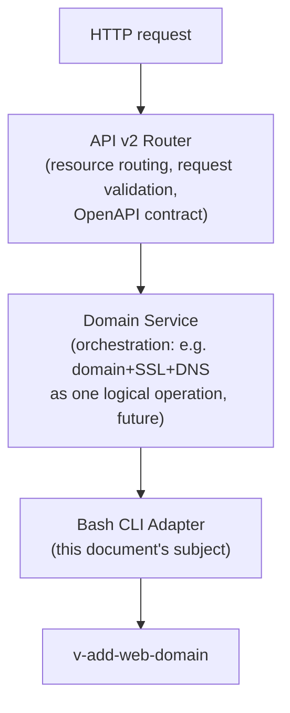

# Bash CLI Adapter / Command Execution Layer — Design

Design-only document. No source files were modified, no adapter code was written, `func/main.sh` was not touched, and no locking was added to produce this document. This design is grounded in `ARCHITECTURE_REVIEW.md` (baseline architecture review and its "Verified Open Questions"/"Roadmap Impact" sections) and in additional targeted source reads performed specifically for this design pass. Every non-obvious claim below cites the actual file/line it comes from.

---

## 0. Why this layer, and why now

`ARCHITECTURE_REVIEW.md` established three facts this design must respect:

1. **PHP has no business logic today** — `web/inc/main.php` and `web/api/index.php` independently `exec()` `sudo /usr/local/hestia/bin/v-*` and hand-parse stdout (`web/inc/main.php:246`, `web/api/index.php:190-198,314-320`). There is no shared client library.
2. **The OS-level privilege boundary is a path wildcard, not a command allowlist.** Newly confirmed for this design pass: `install/common/sudo/hestiaweb` grants `hestiaweb ALL=NOPASSWD:/usr/local/hestia/bin/*` — i.e. sudo itself will run *any* file in that directory with *any* arguments. The only things stopping today's PHP layer from invoking an arbitrary `v-*` script with arbitrary arguments are (a) a single regex check in `web/api/index.php:177,260` (`preg_match('/^[a-zA-Z0-9_-]+$/', $hst_cmd)`, which validates the command *name* shape only, not membership in any allowlist) and (b) each script's own internal argument validation. **There is no command allowlist anywhere in the current architecture** except the access-key permission string described below. This materially raises the priority of the adapter's own allowlist (§5).
3. **Confirmed, unmitigated race conditions exist** in shared `USER_DATA/*.conf` file access (`func/main.sh:258-280` `is_package_full()`, `func/main.sh:667-678` `update_object_value()`, `func/main.sh:727-753` `increase_user_value()`/`decrease_user_value()`) — per `ARCHITECTURE_REVIEW.md`'s "Roadmap Impact" section, this is now a **confirmed correctness prerequisite**, not a hypothetical, for anything that adds concurrency. This design proposes where serialization should live (§6) without implementing it.

The one existing precedent worth reusing is the **access-key permission model**: `bin/v-add-access-key` (`bin/v-add-access-key:2-9,61-66`) already stores a comma-separated allowlist of permitted `v-*` command names per key (`v-add-access-key admin v-purge-nginx-cache,v-list-mail-accounts comment json`), sanitized by `cleanup_key_permissions()` (`func/main.sh:1997-2011`, which strips paths via `basename` and dedupes). `bin/v-check-access-key` additionally supports a `USER_ARG_POSITION` concept scoping a key to only operate on its own user (referenced in the original review, `web/api/index.php:290-312`). This is real prior art for "allowlist + scoping" — the adapter's registry (§2) and security model (§5) should be recognizable evolutions of this pattern, not something invented from scratch.

---

## 1. Responsibilities

### The adapter SHOULD:

- Expose a **fixed, versioned set of named operations** (e.g. `domain.create`), each mapped internally to exactly one `v-*` invocation strategy (§2).
- Own **all** process execution against `bin/v-*` — after adoption, `web/inc/main.php` and `web/api/index.php` should have zero direct `exec()` calls to `HESTIA_CMD`.
- Perform **argument marshalling**: translate typed, named parameters (`{domain: "example.com", ip: "203.0.113.5"}`) into the correct positional CLI arguments for the underlying script, including correct shell-quoting.
- Perform **output parsing**: convert each script's stdout convention (today: `json`/`shell`/`plain` as a literal trailing argument, per `web/inc/main.php:246`, `bin/v-list-backup-host-restic:26-45`) into one canonical result shape (§7), regardless of what the underlying script emits.
- Own **exit-code interpretation**: map `func/main.sh`'s `E_*` constants (`func/main.sh:109-129`: `E_ARGS=1` through `E_RESTART=20`) into the structured result's `error_code`, replacing the duplicated, partial mapping currently split between `web/inc/helpers.php:57-85` (`exit_code_to_http_code`) and ad hoc checks scattered through `web/inc/main.php` (`check_error`, `check_return_code`, `check_return_code_redirect`, lines 146-177).
- Enforce the **command allowlist and typed-argument boundary** (§5) — this is the layer's primary security responsibility, given finding #2 above.
- Provide the **serialization/locking seam** (§6) — own *where* locks are acquired, even though this design does not implement the lock itself yet.
- Emit **one consistent audit record shape** per invocation (§8), even before a persistent audit store exists.
- Be the **single place** that knows the value of `HESTIA_DIR_BIN`/`HESTIA_CMD` (today hardcoded independently in `web/inc/main.php:20-21` and `web/api/index.php:16-17`).

### The adapter should explicitly NOT:

- **Not reimplement, replicate, or second-guess business logic already inside `v-*` scripts.** Quota checks (`is_package_full`), domain uniqueness/IDN handling, symlink-attack checks (all confirmed in `bin/v-add-web-domain`, per the original review) stay exactly where they are. The adapter is a transport and safety boundary, not a rules engine.
- **Not become a general-purpose shell-command runner.** It executes only registry-defined operations against registry-defined scripts — never an arbitrary string built by a caller.
- **Not introduce a new persistent data store for domain state.** `USER_DATA/*.conf` remains the source of truth; the adapter is stateless with respect to domain/user data (its own audit log is the one exception, and that is additive, not authoritative).
- **Not attempt cross-script transactions or rollback orchestration** at this stage. The original review already flagged (§ API v2 Analysis, "What currently depends too heavily on CLI/Bash") that no cross-script transaction/saga concept exists; building one is explicitly out of scope for this layer (§12).
- **Not change any `v-*` script's signature, output format, or behavior.** The CLI remains a stable, independently-usable SSH admin interface, per the original review's "CLI-as-public-contract tension" risk.
- **Not decide auth/session policy.** Whether a caller is allowed to invoke `domain.create` at all (RBAC role, session validity, CSRF) is the caller's (Service Layer's) job; the adapter's allowlist is a second, independent gate (defense in depth), not a replacement for upstream authorization.

---

## 2. Command Registry

### Design

The registry is the **single mapping table** from a stable, resource-oriented **operation name** to (a) the underlying `v-*` script(s), (b) a typed parameter schema, and (c) an output/error contract. It is data, not code — conceptually a static table (could be a PHP array literal, a JSON/YAML file, or Go struct literals depending on what eventually hosts the adapter; storage format is an implementation detail deferred past this design).

### Naming convention

`<resource>.<action>` — mirrors the resource nouns the original review already proposed for API v2 (`/domains`, `/mail/accounts`, `/databases`, `/backups`, `/ssl/certificates`, `/dns/zones`, `/cron/jobs`, `/firewall/rules`, `/servers`). Examples, explicitly **not** 1:1 with script names:

| Operation | Underlying script(s) | Notes |
|---|---|---|
| `domain.create` | `v-add-web-domain` | direct 1:1 today |
| `domain.delete` | `v-delete-web-domain` | direct 1:1 |
| `domain.list` | `v-list-web-domains` (plural script, singular-per-item result) | naming mismatch between operation and script is exactly what the adapter exists to absorb |
| `domain.get` | `v-list-web-domain` (singular script) | registry disambiguates `domain.list` vs `domain.get` even though Hestia's own naming (`v-list-web-domain` vs `v-list-web-domains`) is a one-character, easily-mistaken difference — the adapter removes that footgun from every caller |
| `user.create` | `v-add-user` | |
| `database.create` | `v-add-database` | |
| `backup.create` | `v-backup-user` **or** `v-backup-user-restic`, selected by a registry-level feature flag reading `BACKUP_INCREMENTAL`/system config, not by the caller | absorbs the two-engine split documented in the original review's Backup Analysis |
| `ssl.renew` | `v-add-letsencrypt-domain` (re-invoked; the script is itself idempotent per its own `KID`-presence check, `bin/v-add-letsencrypt-user:72-74`) | operation name describes intent ("renew"), not the underlying script's actual verb ("add") |

This table is the concrete answer to "do not blindly use `v-add-web-domain` as the public abstraction": the **operation name is chosen from the resource's perspective**, and the mapping to one or more scripts, in what order, with what argument transformation, is registry detail hidden from every caller.

### Registry entry shape (conceptual, language-agnostic)

```
operation: "domain.create"
description: "Create a web domain (vhost) for a user"
underlying:
  - script: "v-add-web-domain"
    argument_order: [user, domain, ip, restart, aliases, proxy_ext]   # positional order the script requires today
parameters:
  user:        { type: username, required: true }
  domain:      { type: domain,   required: true }
  ip:          { type: ip,       required: false }
  aliases:     { type: domain_list, required: false, default: "none" }
  proxy_ext:   { type: string,   required: false }
  restart:     { type: internal, value: "yes" }   # not caller-supplied — adapter fills a fixed value; see §3
output_format: "json"          # adapter always requests the script's json mode when one exists
lock_scope: "user:{user}"      # see §6
role_required: "user"          # minimum RBAC role able to invoke this at all — enforced by caller, not adapter; recorded here only for documentation/audit correlation
idempotent: false
timeout_seconds: 30
```

A few things this schema deliberately does, tied to concrete evidence:

- **`argument_order` is explicit and versioned per entry**, because script argument order is a positional contract today (`bin/v-add-web-domain:20-26`: `user=$1; domain=$2; ip=$3; restart=$4; aliases=$5; proxy_ext=$6`) with no named-argument support at the CLI level. If a future Hestia release reorders or adds an argument, **only the registry entry changes**, not every call site — this is precisely the decoupling the original review's API v2 analysis called for ("decouples the public API contract from CLI script signatures").
- **`output_format` is fixed per-operation by the registry, not by the caller**, closing the gap where today a caller must remember to append the literal string `json` (as seen throughout `web/inc/main.php`, e.g. line 246 `"v-list-user " . $username . " json"`) — forgetting it silently degrades to `shell` format and breaks JSON parsing downstream. The registry makes this a can't-forget, not a convention.
- **`lock_scope` is a first-class registry field** (§6), so locking granularity is declared once per operation, not decided ad hoc by each caller.

### What the registry is NOT

- Not a full OpenAPI spec (no HTTP concerns — that's API v2's job, layered on top per §9).
- Not a code generator, at least not at this design stage — whether entries are hand-written or later generated from `# options:` header comments (as the original review's API v2 Analysis speculated) is an implementation decision deferred past this document. Given that this design pass found at least two scripts whose header comments are stale/mismatched with actual behavior (`bin/v-add-backup-host-restic`'s header describing `TYPE HOST USERNAME PASSWORD` while the body implements `REPO SNAPSHOTS DAILY WEEKLY MONTHLY YEARLY`, and `bin/v-update-user-cgroup`'s header reading "update user disk quota" — both confirmed in `ARCHITECTURE_REVIEW.md`'s Verified Open Questions), **auto-generating the registry from header comments is explicitly not recommended** — headers are demonstrably unreliable. Registry entries must be hand-verified against actual script bodies, at least initially.

---

## 3. Input Validation

Four layers exist or will exist; the adapter's job is to occupy exactly one of them and not duplicate the others.

| Layer | Where | What it validates | Status today |
|---|---|---|---|
| **API validation** | Future API v2 router / today's `web/api/index.php` | Request well-formedness: required fields present, JSON parses, auth credentials present (`web/api/index.php:357-367` request-shape branching) | Exists today, stays at this layer |
| **Service/business validation** | Future Service Layer, or the adapter's registry `parameters` schema (§2) in the near term since no separate Service Layer exists yet | **Type and shape** of each argument: is this a syntactically valid domain, a valid IP, a value from the operation's parameter schema. This is *new* — see below. | Does not exist as a distinct layer today |
| **Hestia CLI validation** | Inside each `v-*` script, via shared `func/main.sh` helpers (`is_format_valid`, `is_object_valid`, `is_object_unsuspended`, `is_package_full`, `is_domain_new`, `is_dir_symlink`, all confirmed present and exercised in `bin/v-add-web-domain:59-77`) | **Business rules and system state**: does this user exist, are they suspended, is their package quota exceeded, does this domain already exist, is this a symlink attack | Exists today, extensive, authoritative — must not be duplicated |
| **OS-level validation** | Kernel/filesystem/systemd | Permission checks, `EEXIST`/`ENOENT` on actual file operations, systemd unit validity | Exists today, outside Hestia's control |

### Where the adapter fits, and the duplication rule

The adapter owns the **second layer boundary only in a narrow sense**: it validates that a supplied argument has the *correct type/shape to be safely and correctly forwarded* to the underlying script (e.g., "is this string plausibly a domain name" before it's used to build a positional CLI argument) — this is necessary purely for **safe argument construction and clear early errors**, not for re-deciding business rules the CLI already owns authoritatively.

Concretely:

- **Do**: validate that `domain` matches a domain-name shape, that `ip` parses as an IP, that `user` matches Hestia's username character class — because a malformed value here would otherwise either break shell-argument construction or produce a confusing downstream CLI error that's harder for a caller to interpret.
- **Do not**: re-check "does this user exist," "is the package full," "is this domain already taken by someone else" — `is_object_valid`, `is_package_full`, `is_domain_new` (`func/main.sh`, exercised by `bin/v-add-web-domain`) already do this, authoritatively, against live system state at the moment of execution. Duplicating it in the adapter would (a) waste an extra process/read for state the CLI is about to re-check anyway, and (b) risk a TOCTOU gap of its own between the adapter's check and the CLI's check — the *opposite* of what §6 is trying to fix.

This "shape-only" validation split directly mirrors the pattern already used for HTTP-facing error codes: the adapter's shape validation should fail fast with something equivalent to `E_ARGS`/`E_INVALID` (reusing `func/main.sh`'s existing constants conceptually, §7) *before* a subprocess is even spawned, while everything else stays exactly where `func/main.sh` and each `v-*` script already put it.

One parameter class needs special handling: **adapter-internal/fixed values**, like `restart` in the `domain.create` example above (§2) — arguments that exist in the script's positional signature but that the adapter itself decides (not the caller) because they're an implementation detail of *how* the adapter invokes the script, not a caller-facing concept. These are declared in the registry with a fixed `value`, never sourced from caller input, and therefore need no validation at all — they're not attacker/caller-controlled.

---

## 4. Execution

This section deliberately audits **what's missing today**, since the adapter's execution model is defined largely by closing those gaps.

### Confirmed current behavior (baseline)

- **Argument escaping**: already handled correctly today via `Hestiacp\quoteshellarg\quoteshellarg()` (used throughout `web/inc/main.php` and `web/api/index.php`, e.g. `web/api/index.php:91-92,193-195,271-279`) and `escapeshellcmd()` on the command name itself (`web/api/index.php:190,315`). **This part is not broken and the adapter should keep using the same helper**, not reinvent quoting.
- **Environment variables**: none are deliberately set today beyond what PHP's `exec()` inherits from the web server process; `HESTIA_CMD` embeds `sudo` directly into the command string rather than using an explicit environment-based privilege escalation call.
- **Exit codes**: captured (`$return_var`/`$cmd_exit_code` in both PHP entry points) but interpreted inconsistently — `web/api/index.php` maps them via `exit_code_to_http_code()`; `web/inc/main.php`'s `check_error()`/`check_return_code()` do their own separate, simpler thing (redirect-on-nonzero, or stash `$_SESSION["error_msg"]`).
- **stdout**: captured via PHP's `exec($cmd, $output, $return_var)` array form; joined with `implode("", ...)` (API) or `implode("<br>", ...)` (UI error display) — two different join strategies for two different purposes, confirmed inconsistent between the two entry points.
- **stderr**: **not separately captured anywhere.** PHP's `exec()` merges stderr into the same stream only if the caller appends `2>&1` to the command string — neither `web/inc/main.php` nor `web/api/index.php` does this. This means today, script errors written to stderr (as opposed to stdout, which is what `check_result()`'s `echo "Error: $2"` in `func/main.sh:3-4` writes to, i.e. stdout) are silently discarded from the HTTP-facing caller's perspective, though they still land in `$HESTIA/log/error.log` via `log_event` (`func/main.sh`, confirmed above).
- **Timeouts**: **confirmed absent.** No `timeout(1)` wrapping, no `proc_open()`-with-deadline, no `set_time_limit()` call was found in `web/inc/main.php`, `web/api/index.php`, or `web/inc/helpers.php`. A hung `v-*` script (e.g. a stalled `mysql`/`restic`/`curl` call inside it) blocks the PHP request indefinitely, bounded only by PHP's own generic `max_execution_time` if one is configured — not a deliberate per-operation timeout.
- **Signals/cancellation**: **confirmed absent.** `exec()` provides no mechanism to cancel an in-flight subprocess from the calling PHP code; there is no cancellation concept anywhere in the current architecture.

### Adapter execution design

- **Process invocation**: use `proc_open()` (or the eventual host language's equivalent) instead of `exec()`, specifically to get **separate stdout/stderr streams** and a **live process handle** that can be waited on with a deadline and killed. This is the one concrete implementation-level change needed to close the stderr and timeout gaps above; it does not change what gets invoked (`sudo /usr/local/hestia/bin/v-*`), only how the adapter observes and controls it.
- **Argument escaping**: keep `quoteshellarg()` per-argument, applied by the adapter at the point where registry parameters are turned into a positional argument list — never let a caller supply a pre-built command-line string.
- **Environment**: the adapter constructs a **minimal, explicit environment** for the child process rather than inheriting the web server's full environment wholesale — see §5 (Environment sanitization) for what that means concretely and why it matters given the sudoers wildcard finding.
- **Exit codes**: every invocation's raw exit code is preserved unmodified into the structured result (§7) as `exit_code`; the adapter additionally maps it to one canonical `error_code` using `func/main.sh`'s existing `E_*` taxonomy (`func/main.sh:109-129`) as the source of truth — the adapter does not invent a new error-code space, it adopts Hestia's existing one, since that is what every `v-*` script already returns.
- **Timeouts**: every registry entry declares a `timeout_seconds` (§2). On timeout, the adapter sends `SIGTERM` to the child, waits a short grace period (e.g. 5s), then `SIGKILL`s if still alive — standard graceful-then-forceful shutdown. The resulting structured result gets a dedicated `error_code: TIMEOUT` (not reusing any `E_*` code, since none of Hestia's existing codes mean "the adapter gave up waiting" — this is a new, adapter-native condition).
- **Cancellation**: modeled as "caller-requested early timeout" — the adapter does not need a bespoke cancellation protocol distinct from the timeout mechanism above; a cancellation request simply triggers the same SIGTERM→grace→SIGKILL sequence on demand rather than after a deadline. **Caveat, stated plainly**: killing a `v-*` script mid-execution does **not** guarantee the underlying operation is safely rolled back — these scripts have no transactional rollback (confirmed in the original review). Cancellation stops the adapter from *waiting* on the process; it does not make the underlying system operation cancel-safe. This must be documented prominently wherever cancellation is exposed to callers.
- **Structured errors**: see §7.
- **Logging**: every invocation produces one audit-log-shaped record regardless of success/failure (§8), independent of and in addition to whatever the invoked script itself writes to `$HESTIA/log/system.log`/`error.log` via `log_event`.

---

## 5. Security

This is the section the sudoers finding most directly reshapes.

### The actual current boundary (restated precisely)

`install/common/sudo/hestiaweb`: `hestiaweb ALL=NOPASSWD:/usr/local/hestia/bin/*`. Sudo enforces **only** that the executed file lives under `/usr/local/hestia/bin/` — it does not restrict *which* file, nor with *which arguments*. Today's only command-shape gate is the regex in `web/api/index.php:177,260` (`^[a-zA-Z0-9_-]+$`), which stops shell metacharacters in the command name but does **not** restrict the command to any specific set — any of the 524 `v-*` scripts (or any future file dropped into that directory) is invocable by the `hestiaweb` user with that regex satisfied. Argument-level restriction is entirely delegated to each script's own internal validation.

This means: **today, "security" for what operations the web layer can trigger is provided almost entirely by (a) which PHP code paths choose to call which commands, and (b) each script's own internal checks** — not by any allowlist. A bug or injection in PHP that lets an attacker control the `cmd`/`arg*` values reaching `web/api/index.php`'s dispatch (e.g., a parameter-pollution or logic bug upstream of the regex check) has a very large blast radius: any of 524 scripts, with attacker-influenced positional arguments, run as the `hestiaweb` sudo target.

### Adapter security design, directly responding to this

1. **Allowlisted commands, enforced twice**:
   - **Registry membership** (§2): the adapter will only ever construct a command line for an operation that has a registry entry. There is no "pass through an arbitrary command name" path in the adapter's public interface at all — unlike today's `web/api/index.php`, where `cmd` is caller-supplied and only shape-checked.
   - **Recommendation**: additionally tighten the sudoers policy itself, *after* the adapter is the only caller, to an explicit list (`hestiaweb ALL=NOPASSWD:/usr/local/hestia/bin/v-add-web-domain, /usr/local/hestia/bin/v-delete-web-domain, ...`) generated from the registry's `underlying.script` values. This is **not part of this design's immediate deliverable** (it modifies `func/main.sh`-adjacent install-time config, arguably out of scope alongside "do not add flock yet") but is flagged here as the natural next hardening step once the registry is the sole source of truth for which scripts are ever legitimately invoked — see §12 for why it's deferred rather than designed in detail now.
2. **Typed arguments**: every registry parameter has a declared `type` (username, domain, ip, domain_list, password, string, internal — §2, §3). The adapter rejects any value that doesn't match its declared type *before* attempting to build a shell argument. This is what makes "no arbitrary command execution" actually true for the adapter's own surface, independent of what the underlying script would have tolerated.
3. **Privilege boundary / sudo usage**: unchanged at the OS level for this design (the adapter still shells to `sudo /usr/local/hestia/bin/v-*`, same as today) — the adapter does not attempt to run as root directly, does not attempt to bypass sudo, and does not introduce a new setuid/privileged component. The privilege model stays "one blessed sudo target user, `hestiaweb`, with NOPASSWD access," exactly as today; the adapter narrows what *reaches* that boundary, not the boundary itself. Narrowing the boundary itself is the sudoers-policy follow-up noted above, deliberately deferred.
4. **Environment sanitization**: the adapter should construct each child process with an **explicit, minimal environment** — `PATH` set to a fixed, known value; no inherited web-server environment variables (session secrets, PHP-FPM pool env vars, etc.) passed through unless a specific registry entry explicitly declares it needs one. This directly follows from `func/main.sh`'s own `source_conf()` reserved-variable list (`func/main.sh:15-30`, already present in the codebase and extensively commented on exactly this risk class: `PATH`/`IFS`/`ENV`/`LD_PRELOAD`/etc. injection) — the adapter's job is to make sure a *hostile or merely-sloppy* PHP/web-layer environment can never smuggle a dangerous variable into the child process in the first place, which is a complementary, "shift-left" version of the defense `source_conf()` already implements for config-file parsing.
5. **Sensitive argument handling**: several existing scripts already mark certain positional arguments as sensitive via a `HIDE=<n>` convention (confirmed in `bin/v-check-user-password:14` `HIDE=2`, `bin/v-add-backup-host:19` `HIDE=4`, `bin/v-add-access-key`'s secret generation) — this convention presumably suppresses that argument from `$ARGUMENTS`-based logging (`log_event "$OK" "$ARGUMENTS"` calls seen throughout `bin/*`; the exact suppression mechanism was not traced further in this pass — **Needs further investigation** if adapter logging needs to bit-for-bit match it). The registry's parameter schema (§2) should carry an explicit `sensitive: true` flag per parameter, independently of whatever `HIDE=` does inside the script, so the adapter's *own* audit log (§8) never writes passwords/secret keys/private key material in cleartext — this must not be assumed to be automatically consistent with each script's internal `HIDE` handling, since the adapter's logging is a separate code path.
6. **Audit logging**: see §8; noted here because audit logging is itself a security control (detection/accountability), not only an operability nicety.

### What this design does NOT claim to fix

The adapter closes the gap **at its own boundary**. It does not retroactively make the sudoers wildcard itself an allowlist (that requires the separate, deferred sudoers-policy change above), and it does not make any individual `v-*` script's own argument handling more robust than it already is — a script-level bug (e.g., unsafe use of an argument inside the script itself) is outside this layer's ability to fix, by design (§1: "not reimplement business logic").

---

## 6. Concurrency / Locking

### Restating the confirmed problem (from `ARCHITECTURE_REVIEW.md`, Verified Open Questions Area 2)

Three concrete race windows, all in `func/main.sh`, all without any existing lock:

- `is_package_full()` (`func/main.sh:258-280`): quota check (read) happens long before the calling script's eventual append (write) — classic check-then-act.
- `increase_user_value()` / `decrease_user_value()` (`func/main.sh:727-753`): read-old → compute-new → `sed -i` replace, no lock — classic lost-update.
- `update_object_value()` (`func/main.sh:667-678`): `grep -nF` for a line number, then `sed -i` by that line number — a second process's concurrent edit can shift line numbers mid-window.

### Options considered

**A. Global lock** (one lock for all Hestia operations, system-wide). Rejected as the default: correctness-simplest, but serializes unrelated operations across unrelated users (admin A creating a domain blocks admin B changing their own password) — unnecessary contention for a multi-tenant panel, and directly contradicts the "don't introduce unnecessary complexity/bottlenecks" spirit of the original review's Service Layer critique. Its one legitimate use is for a small number of genuinely system-wide, config-singleton operations (see "per-resource" below).

**B. Per-user lock.** Serializes all operations belonging to one Hestia user (all their domains, mail, databases, cron, backups). Directly matches the actual shared-state boundary for two of the three confirmed races: `increase_user_value`/`decrease_user_value` operate on `$HESTIA/data/users/$1/user.conf` (a single file per user), and `is_package_full`'s quota counters are also per-user aggregates read from that same user's data. A per-user lock would correctly close both of those races.

**C. Per-domain lock.** Finer-grained than per-user; would correctly serialize concurrent edits to one domain's own config, but **would not** close the quota-counter race, because `WEB_DOMAINS`/`MAIL_DOMAINS`/etc. counters live in `user.conf`, one level up from any single domain — two different domains under the same user could still race on the shared user-level counter even if each domain's own lock is respected.

**D. Per-resource lock** (i.e., lock scoped to the exact file being mutated — `user.conf` vs. `web.conf` vs. `dns/$domain.conf` individually). Most precise in theory, but doesn't match how the actual race manifests: `is_package_full` reads `web.conf` (via `wc -l`) but the limit and the eventual counter update live in `user.conf` — the operation that needs atomicity spans **more than one file** (check `web.conf`'s row count against `user.conf`'s limit, then later append to `web.conf`) and finer-than-user locking would require multi-file lock ordering to avoid deadlock, adding real complexity for marginal gained concurrency (per-domain operations for the same user are not a demonstrated bottleneck).

**E. Another mechanism — optimistic concurrency (version/CAS on conf files).** Rejected for this stage: would require modifying `func/main.sh`'s file format or read/write helpers to carry a version token, which is explicitly out of scope ("do not modify `func/main.sh` yet"). Worth reconsidering only if per-user locking is later shown to be an actual throughput bottleneck (see recommendation below).

### Recommendation: **B — per-user lock, held by the adapter around the entire operation**

**Lock scope**: one lock per Hestia username (e.g., conceptually keyed `"user:<username>"`), covering **the full adapter-side execution of any operation whose registry entry declares `lock_scope: user:{user}`** (§2) — not just the underlying script's own runtime, but the adapter's full request handling for that operation, so that two concurrent adapter calls for the same user are fully serialized end-to-end, closing the check-then-act and lost-update windows regardless of exactly where inside the script the actual read/modify/write happens (which the adapter cannot see or control without modifying the scripts themselves, per the explicit constraint of this task).

**Which operations share a lock**: every operation whose `underlying` script(s) read or write anything under `$HESTIA/data/users/<username>/` for that specific `<username>` — concretely, this covers essentially all `domain.*`, `mail.*`, `database.*`, `dns.*`, `cron.*`, and `backup.*`/`restore.*` operations for a given user, because all of them ultimately touch that user's `USER_DATA` tree (confirmed pattern: `$USER_DATA/web.conf`, `$USER_DATA/mail.conf`, `$USER_DATA/backup-excludes.conf`, etc., referenced throughout `bin/v-backup-user` and the `is_package_full` case statement, `func/main.sh:260-268`). Operations on genuinely different users (`admin`'s domain creation vs. `bob`'s password change) do **not** share a lock and proceed fully in parallel — this is the core benefit over option A.

**System-wide/admin-level operations** (e.g., a hypothetical `system.config.update`, or backup-host configuration which writes to `/usr/local/hestia/conf/restic.conf` — confirmed global, not per-user, in `bin/v-add-backup-host-restic:82-87`) should declare `lock_scope: global` explicitly in their registry entry — this is option A used narrowly, exactly where it's actually correct, rather than as the default.

**Explicitly addressing the four races named in the task**:
- *Quota check → append races*: closed, because both the `is_package_full` check and the later append happen inside one adapter-held per-user lock for the whole `domain.create`-style operation.
- *Counter update races*: closed, same mechanism — `increase_user_value`/`decrease_user_value` calls always happen for a user whose lock the adapter is already holding for the enclosing operation.
- *Concurrent domain modifications*: closed at user granularity (two edits to the same user's domains serialize); note this is intentionally coarser than per-domain — two *different* domains under the same user will also serialize against each other under this design, which is a deliberate, documented trade-off (see below) rather than an oversight.
- *Concurrent backup/restore conflicts*: closed the same way, and additionally worth calling out that this is exactly right for backups specifically — `bin/v-backup-user-restic` treats a user's entire home directory and restic repo (`"${REPO%/}/$user"`) as one atomic unit already, so a restore racing a backup for the same user is a real, currently-unmitigated hazard this design directly targets.

**Documented trade-off of per-user granularity**: a user with many domains will have all domain operations serialize against each other, even across unrelated domains, which is coarser than strictly necessary for pure domain-content edits. This is accepted deliberately because (a) it's the smallest granularity that provably closes all three confirmed race conditions without multi-file lock ordering, (b) typical per-user operation volume (a human admin, or a handful of automated jobs, acting on one account) is not a demonstrated throughput problem today, and (c) if it later becomes one, the registry's `lock_scope` field (§2) is already parameterized per-operation — a future, more surgical `lock_scope: domain:{user}:{domain}` could be introduced for read-heavy or provably-independent operations *without* redesigning the mechanism, only by changing individual registry entries.

**What is explicitly NOT designed here, per the task's constraint**: the actual lock primitive (`flock` on a per-user lock file under e.g. a new `$HESTIA/data/users/<user>/.lock`, an in-process mutex if the adapter is a long-lived daemon, or a distributed lock if the adapter is ever horizontally scaled) is an implementation detail intentionally left open. This design commits only to: **lock granularity = per Hestia user**, **lock is acquired by the adapter, not by any modified `v-*` script**, and **lock scope = the operation's declared `lock_scope` registry field**, with `global` reserved for genuinely system-wide config.

---

## 7. Result Model

### Critique of the example given

The prompt's example (`success, exit_code, stdout, stderr, error_code, error_message, duration, command_id`) is a reasonable starting skeleton but has three gaps once measured against what §4–§6 actually need to report:

1. **No distinction between "the underlying script ran and returned a Hestia error" vs. "the adapter itself couldn't even run it"** (allowlist rejection, validation failure, timeout, lock-acquisition failure). Collapsing all of these into one `error_code` alongside the script's own `E_*` codes conflates two very different failure classes that callers (and audit consumers) need to tell apart.
2. **No field capturing which registry operation and resolved script(s) actually ran** — for `backup.create`, which silently chooses between `v-backup-user` and `v-backup-user-restic` (§2), a caller/auditor needs to know which one actually executed, not just that "`backup.create`" was requested.
3. **`success: boolean` is redundant and can drift from `exit_code`/`error_code`** if not derived consistently — better to derive it, not store it independently.

### Proposed model

```
{
  "operation": "domain.create",              // registry operation name, not script name
  "resolved_command": "v-add-web-domain",     // which underlying script actually ran (§2: matters when registry maps 1 operation -> multiple possible scripts)
  "command_id": "01J...ULID",                 // unique per invocation, used for audit correlation (§8) and idempotent retry detection
  "status": "ok" | "hestia_error" | "adapter_error" | "timeout" | "cancelled",
                                               // the "gap #1" fix above — distinguishes failure origin
  "exit_code": 0,                             // raw exit code from the underlying process, always preserved verbatim
  "hestia_error_code": null,                  // populated only when status == "hestia_error"; one of func/main.sh's E_* names (e.g. "E_LIMIT"), not a bare integer, for readability and stability across any future renumbering
  "adapter_error_code": null,                 // populated only when status == "adapter_error" | "timeout" | "cancelled"; adapter-native codes: VALIDATION_FAILED, NOT_ALLOWLISTED, LOCK_TIMEOUT, TIMEOUT, CANCELLED
  "error_message": null,                      // human-readable, derived from stderr/stdout per §4, never null when status != "ok"
  "stdout": "...",                            // captured verbatim
  "stderr": "...",                            // captured verbatim (new — not available at all today, per §4)
  "parsed_output": { ... } | null,            // when output_format == json and parsing succeeded, the decoded structure; null otherwise — saves every caller from repeating json_decode(implode(...))
  "started_at": "2026-08-12T14:03:11Z",
  "finished_at": "2026-08-12T14:03:12Z",
  "duration_ms": 812,
  "lock_wait_ms": 4,                          // time spent waiting to acquire the operation's lock (§6) before execution began — useful both operationally and as an early signal of lock-contention problems from the coarser per-user granularity
  "actor": { "user": "admin", "acting_as": null },   // who requested it (ties directly into §8; "acting_as" captures Hestia's existing "look"/impersonation session concept, confirmed in web/inc/main.php:133-136,190)
  "target": { "user": "bob", "domain": "example.com" } // resource(s) the operation targeted, structured, not just baked into a log line
}
```

`status` is the field callers branch on; `exit_code`/`hestia_error_code`/`adapter_error_code` are for detail and audit, not primary control flow — this avoids the redundant-boolean problem while still preserving every piece of information the original example wanted.

---

## 8. Auditability

Design only — no logging is implemented by this document.

### What must be recorded per invocation, and where it comes from

| Field | Source |
|---|---|
| Who requested it | The `actor` from §7 — sourced from the caller's session (`$_SESSION["user"]`/`$_SESSION["look"]`, confirmed pattern at `web/inc/main.php:128-136`) or, for API-key callers, the access key's associated user (`v-check-access-key`'s `USER` output, confirmed in `bin/v-check-access-key`'s `json_list()`) |
| What operation was requested | `operation` + `resolved_command` from §7 |
| What resource it targeted | `target` from §7 — populated from the registry's typed parameters that are marked as resource-identifying (e.g. `domain`, `database_name`), not free-text |
| When it started / finished | `started_at`/`finished_at` from §7 |
| Whether it succeeded | `status` from §7 |
| What changed | **Not reliably derivable from the adapter alone** — see below |

### The "what changed" gap, stated honestly

The adapter observes a command's stdout/stderr/exit code — it does **not** inherently know the semantic diff of what changed in `USER_DATA/*.conf` as a result (Hestia has no before/after state-diffing anywhere today). Two honest options, neither implemented here:

1. **Coarse but immediate**: record only the *declared intent* (operation + parameters + target) as "what changed," accepting that this describes what was *requested*, not independently verified as what *happened* to on-disk state. This is consistent with what Hestia's own existing `v-log-action`/`log_event` mechanisms already do (`bin/v-log-action`, `func/main.sh log_event`) — they log the action taken, not a state diff — so the adapter would be at parity with, not behind, current practice.
2. **Precise but heavier**: have the adapter snapshot the relevant `USER_DATA` file(s) before and after (per the operation's declared `target`) and compute a diff. This is real additional work and a real additional read/write cost on every single operation, and duplicates information the underlying script's own object model already has. **Not recommended for the initial design** — flagged in §12 as something to explicitly not build yet — but noted as the natural upgrade path if audit-grade "what changed" ever becomes a hard requirement (e.g. compliance).

### Relationship to existing logging

Hestia already writes to `$HESTIA/log/system.log` and `$HESTIA/log/error.log` via `log_event()` (`func/main.sh`, confirmed above), and to a separate user/system action log via `v-log-action` (confirmed used in `bin/v-backup-user-restic`: `$BIN/v-log-action "$user" "Info" "Backup" "Backup created."`). The adapter's audit record is **additive**, not a replacement — it captures the adapter-level view (who called the adapter, with what typed parameters, lock wait time, adapter-vs-Hestia error distinction) that the script-level logs cannot see, while the script-level logs continue to capture whatever business-level detail each script already chooses to record. No existing logging is proposed to be removed or modified.

### Where records should eventually live (not decided here)

Whether the audit record store is a new flat file, a new SQLite database, or (eventually) something a Go daemon owns is explicitly deferred — this design commits only to the **shape** of the record (§7's structure plus the actor/target framing above), not its storage engine, per the "design only, do not implement" constraint.

---

## 9. Future API v2



The adapter sits **exactly where `web/inc/main.php`'s and `web/api/index.php`'s `exec()` calls sit today** — it is a drop-in replacement for that one specific responsibility, not a new layer inserted alongside them. API v2's router calls a Service (per the original review's Service Layer Analysis) which calls the adapter for any operation that maps to an existing registry entry.

### What happens when API v2 needs an operation with no existing `v-*` command

This is the important edge case the task specifically asks to address, and the honest answer is: **the adapter cannot manufacture a capability that doesn't exist in the CLI.** Concretely, three sub-cases:

1. **The operation is a *composition* of existing commands** (e.g., "create domain with SSL in one call" = `domain.create` then `ssl.request` then, if either fails, some cleanup). This belongs in the **Service Layer**, not the adapter — the Service Layer calls the adapter multiple times and owns the orchestration/rollback-attempt logic across those calls. The adapter's job stays "one registry operation, one (or a registry-defined small, fixed set of) `v-*` invocation(s)" — it does not grow ad hoc multi-step workflows internally, which would blur the line between "adapter" and "service" and make the adapter's own behavior harder to reason about and test.
2. **The operation genuinely requires new business logic that doesn't exist in any script** (e.g., a bulk/batch operation Hestia's CLI has no equivalent for, or a new concept like "domain templates" that isn't part of today's data model). This requires **writing a new `v-*` script** (staying consistent with "the existing v-* commands should remain the underlying implementation," per the task's own framing) and registering it, or — only once the fork has decided to actually introduce a non-Bash implementation for a given capability — implementing it natively behind a *new* registry entry whose `underlying` is not a Bash script at all but some other execution strategy. The registry's `underlying` field (§2) is deliberately modeled as "one or more invocation steps" rather than hard-coded to "exactly one Bash script," specifically so this substitution is possible later **without changing the registry's public shape** — but building that alternate execution strategy is explicitly not part of this design (§12).
3. **The operation requires information Hestia's CLI cannot currently produce** (e.g., real-time streaming progress for a long backup, which today is only observable as "the process is still running or it isn't"). This is a capability gap in the underlying scripts themselves, not something the adapter or API v2 can paper over — it would need to be solved at the script level (e.g., a script that writes progress to a well-known file/fifo the adapter can poll) before API v2 can expose it meaningfully.

---

## 10. Future Go

### Can Go call the same operation layer without forcing an immediate rewrite?

**Partially, and only if the registry is treated as the portable artifact, not the adapter's current implementation.** Concretely:

- If the adapter is first built as a PHP library (the natural, lowest-risk first step, since it lives right where `web/inc/main.php`/`web/api/index.php` already are), a future Go daemon **cannot directly call PHP functions**. What Go *can* reuse without a rewrite is:
  - The **registry** itself, if stored as a language-neutral format (JSON/YAML, not a PHP array literal) — both a PHP adapter and a Go adapter can load and interpret the same registry data.
  - The **conventions** this design establishes: same lock granularity (§6), same result-model shape (§7), same audit-record shape (§8), same allowlist-and-typed-argument security posture (§5) — a Go implementation re-expressing these conventions in Go is a **reimplementation of the adapter**, not a reuse of it, but it is a reimplementation *of a well-specified contract* rather than a from-scratch design exercise, which is the realistic, achievable form of "not forcing a rewrite" here.
- **What would NOT need to change**: the underlying `v-*` scripts, the registry's mapping data (if stored language-neutrally), the lock scope decisions, the result/audit shapes, and critically — nothing about `func/main.sh` or any `bin/v-*` script needs to be touched regardless of which language ends up calling them. This is the actual invariant worth protecting, and this design's insistence on keeping the registry as data (§2) rather than code is what makes it possible.

### Critical evaluation — where this optimism breaks down

Being direct about the limits, since the task asks for critical evaluation, not just favorable framing:

- **A second adapter implementation is real, ongoing duplicate-maintenance cost**, not a free reuse. "Go can call the same operation layer" is true at the level of *design contract*, false at the level of *shared code*, for a PHP-first adapter. If Go is coming soon (per the original review's roadmap, Go's first realistic workload is Diagnostics in Phase 4, and Cloud Connect in Phase 7 — both well after this adapter would ship), it is worth explicitly deciding **before** building the PHP version whether to instead build the adapter as a **standalone process from day one** (a small Go or language-agnostic RPC service that both PHP and any future Go component call over a local socket/HTTP, rather than a PHP-in-process library) — this would give genuine code reuse, not just contract reuse, at the cost of introducing a new running process earlier than strictly necessary.
- **This design does not recommend that acceleration** — it would mean introducing a Go (or similar) daemon as part of "the first architectural layer," which contradicts the task's explicit scope ("Do NOT introduce a Go daemon yet"). The design instead **names the trade-off honestly**: building the adapter as a PHP-in-process library now is the correct near-term move given the explicit constraint, but it is accepted, not hidden, that this means a later Go component re-expresses (rather than reuses) the adapter's logic, unless a deliberate follow-up decision is made to extract the adapter into its own process before Go components arrive. That extraction decision is a **Phase 1.5-style follow-up**, not something this design resolves.
- **The architecture would need to evolve again regardless** — this design's honest answer to "is this actually possible" is: the *contract* (registry shape, lock model, result model) survives into a Go future without needing to change; the *implementation* does not, unless the adapter is deliberately extracted into its own process at some point, which is a real, sizable piece of future work this document is not claiming to have already solved.

---

## 11. Migration Strategy

### Current state

```
UI (web/list, web/add, ...) ──┐
                                ├──> exec(sudo v-*) ──> Bash
API (web/api/index.php) ───────┘
```

Two independent call sites, duplicated `HESTIA_CMD` definitions, duplicated JSON-parsing, duplicated (and inconsistent) error handling — all confirmed in the original review.

### Target state (this document's proposal, restated as the migration's end point)

```
UI ──┐
     ├──> Service Layer (thin/pass-through initially) ──> Command Adapter ──> existing v-* commands
API ─┘
```

### Incremental path that never breaks existing functionality

1. **Build the adapter and registry as a self-contained PHP library, called by nothing yet.** Zero risk: nothing existing changes behavior because nothing existing calls it. This is where the registry entries for a first, small slice of operations (recommend starting with read-only `*.list`/`*.get` operations — lowest risk, easiest to verify byte-for-byte equivalence against current behavior) get written and tested against a real Hestia install.
2. **Migrate one read-only call site at a time**, starting with the least-consequential (e.g., `backendtpl_with_webdomains()` in `web/inc/main.php:535-565`, already flagged in the original review as an N+1 `exec()` hot spot — a good first target both because it's read-only and because the adapter's batching-friendly design can demonstrably improve it) to call the adapter instead of `exec()` directly, verifying identical output before and after for the same inputs. Because the adapter's `parsed_output` (§7) is derived from the exact same underlying script and `json` output mode Hestia already uses, output should be identical by construction if the registry entry is correct — any divergence is a signal the registry entry is wrong, not that behavior changed.
3. **Migrate write operations next, one operation at a time**, in order of how well-isolated they are (per the original review's Dependency Map — Firewall and Cron were flagged as narrow/self-contained; good early candidates; Users/Packages, the confirmed "hot spot," should migrate last, after the pattern is well-proven on lower-risk operations, precisely because it's where the confirmed quota/counter races live and where getting the lock-scope integration right matters most).
4. **Only after both `web/inc/main.php` and `web/api/index.php` are fully migrated for a given operation**, remove that operation's now-dead direct-`exec()` code path from both files. Never remove the old path before the new one is proven — this is what "never breaking existing functionality" concretely means at each step: **the adapter is additive until a specific call site is confirmed migrated, and only that call site's old code is then deleted.**
5. **Do not touch `bin/v-*` or `func/main.sh` at any point in this migration.** The entire migration is additive/subtractive only in `web/inc/*.php` and `web/api/index.php` (adding adapter calls, removing old `exec()` calls) plus new adapter/registry code — this is what makes "incremental, non-breaking" actually true rather than aspirational, and is consistent with the original review's "KEEP AS-IS" verdict for the CLI layer.

This mirrors the original review's own Phase 1 recommendation ("Build the BashCliAdapter... and migrate `web/inc/main.php` and `web/api/index.php` onto it — no behavior change, pure de-duplication and structuring") — this design document is the detailed elaboration of exactly that phase.

---

## 12. What NOT to Build (at this stage)

Explicitly out of scope for the adapter's first version, to avoid over-engineering ahead of demonstrated need:

- **No cross-operation transaction/saga engine.** Multi-step orchestration (domain+SSL+DNS as one atomic unit) belongs in a future Service Layer, not the adapter, and even there should wait until a concrete use case demands it (§9).
- **No generic/dynamic command execution escape hatch.** No "just run this v-* command with these args" fallback API, even for admin convenience — this would silently recreate today's unrestricted-dispatch pattern (§5) inside the very layer meant to close it.
- **No new persistent domain-state store.** `USER_DATA/*.conf` stays authoritative; the adapter does not cache, mirror, or shadow it.
- **No actual lock implementation yet** — per the task's explicit instruction, and because the *right* lock primitive (file-based `flock`, in-process mutex, or distributed lock) depends on decisions (is the adapter a request-scoped PHP library or a long-lived daemon?) not yet made. Implementing a specific mechanism now risks building the wrong one.
- **No sudoers-policy tightening yet** — flagged in §5 as the natural follow-up hardening step, but it's a systems-configuration change with its own blast radius (a mis-scoped sudoers allowlist could break legitimate operations at the OS level in a way that's harder to safely roll back than an application-level bug), and should follow, not precede, the registry being complete and proven.
- **No state-diffing/precise "what changed" audit mechanism** (§8) — coarse intent-based audit logging is sufficient for the first version; precise diffing is real added cost that should wait for a demonstrated compliance/debugging need.
- **No registry auto-generation from script header comments** — demonstrated unreliable by this design's own evidence-gathering (two confirmed stale headers). Hand-verified registry entries only, initially.
- **No adapter-as-standalone-process/daemon yet** — despite §10's honest acknowledgment that this would help a future Go component, introducing a new always-running process is exactly the kind of premature infrastructure the original review's Service Layer critique warned against ("introducing the full stack before there are concrete consumers risks over-engineering"). Build it in-process first; extract it later **only if** a concrete second consumer (a Go daemon) is actually being built and the timing makes extraction worthwhile then.
- **No attempt to make every `v-*` script idempotent or cancellation-safe.** Some already are (e.g. `v-add-letsencrypt-user`'s `KID`-presence short-circuit); most are not, and retrofitting that property into 524 scripts is far outside this layer's scope. The adapter surfaces `idempotent`/cancellation caveats honestly (§4, §7) rather than pretending to solve them.

---

## 13. Final Recommendation

### Component responsibilities (summary)

| Component | Responsibility |
|---|---|
| **Command Registry** | Static, hand-verified, language-neutral (JSON/YAML) data mapping resource-oriented operation names to underlying `v-*` script invocation(s), typed parameter schemas, output format, lock scope, and timeout — the single source of truth for "what operations exist and how they map to Bash" |
| **Command Adapter** | Loads the registry; validates caller-supplied arguments against declared types (shape only, not business rules); enforces the allowlist (registry membership is the only path to execution); acquires the operation's declared lock before executing; invokes the underlying script via `proc_open()` with an explicit minimal environment, per-argument `quoteshellarg()` escaping, and a declared timeout; captures stdout/stderr/exit code separately; maps exit codes to Hestia's existing `E_*` taxonomy plus a small set of adapter-native codes; emits one structured result (§7) and one audit record (§8) per invocation |
| **Callers** (today: `web/inc/main.php`, `web/api/index.php`; later: a Service Layer, API v2, a future Go component) | Own authentication, session/RBAC authorization, and any multi-operation orchestration; call the adapter only through registry operation names, never by constructing a command string themselves |

### Interfaces (conceptual, not a code signature — implementation language/framework deferred)

- `adapter.invoke(operation: string, params: map<string, any>, actor: {user, acting_as}) -> Result` — the entire public surface. No secondary "raw exec" method exists.
- `registry.lookup(operation: string) -> RegistryEntry | NotFound` — used internally by `invoke`, and separately by tooling/documentation generation (e.g., could back a future API v2 OpenAPI spec, or a `--help`-style introspection command) without needing to execute anything.

### Data flow (restating §9's diagram as the whole-system picture)

```
Caller (PHP UI / PHP API v1 today, Service Layer + API v2 later, Go later)
  → adapter.invoke(operation, params, actor)
    → registry.lookup(operation)                       [§2 — allowlist gate #1]
    → validate params against registry parameter types  [§3, §5 — allowlist gate #2]
    → acquire lock per registry lock_scope               [§6]
    → build argv via quoteshellarg() per parameter        [§4]
    → proc_open(sudo /usr/local/hestia/bin/<script>, argv, minimal env) [§4, §5]
    → wait with timeout; capture stdout/stderr/exit code   [§4]
    → release lock                                        [§6]
    → map exit code → status/error_code                   [§7]
    → emit audit record                                   [§8]
  ← Result
```

### Security boundaries (summary)

1. Sudoers wildcard (`hestiaweb ALL=NOPASSWD:/usr/local/hestia/bin/*`) — unchanged for now, existing OS-level boundary, narrowing deferred (§5, §12).
2. Registry membership — new, adapter-enforced: only known operations are ever invokable through the adapter.
3. Typed-parameter validation — new, adapter-enforced: only shape-valid arguments are ever forwarded.
4. Minimal explicit child environment — new, adapter-enforced: closes environment-injection risk independent of `func/main.sh`'s own `source_conf()` defenses.
5. `func/main.sh`'s existing business-rule validation (`is_object_valid`, `is_package_full`, etc.) — unchanged, still authoritative, still the *last* and most important gate before any state changes.

### Locking strategy (summary)

Per-Hestia-user lock, held by the adapter for the full duration of any operation whose registry entry targets that user's data; `global` scope reserved for genuinely system-wide config operations; mechanism (flock vs. in-process mutex vs. distributed lock) explicitly deferred pending the in-process-vs-daemon decision.

### Error model (summary)

One `status` enum (`ok`/`hestia_error`/`adapter_error`/`timeout`/`cancelled`) as the primary branch point; raw `exit_code` always preserved; Hestia's own `E_*` codes surfaced by name (not renumbered) when the failure is a genuine Hestia-level error; a small, distinct set of adapter-native codes for failures that never reached a `v-*` script at all.

### Migration strategy (summary)

Build additive and unused first; migrate one read-only call site, verify byte-for-byte equivalence; migrate remaining reads; migrate writes in order of isolation (Firewall/Cron before Users/Packages); delete old `exec()` code path only after its replacement is proven; never touch `bin/v-*` or `func/main.sh`.

### What this buys, concretely, before any of Phase 2 (API v2), Phase 4 (Diagnostics), or Phase 7 (Cloud Connect) begins

A single, auditable, lock-aware, allowlisted chokepoint for all Hestia operations triggered outside of a direct SSH session — replacing two independently-duplicated, unrestricted, unlocked `exec()` call sites — without changing one line of `bin/v-*` or `func/main.sh`, and without committing to any technology choice (Go, daemon-vs-library, specific lock primitive) that the original review's roadmap deliberately deferred to later phases.
