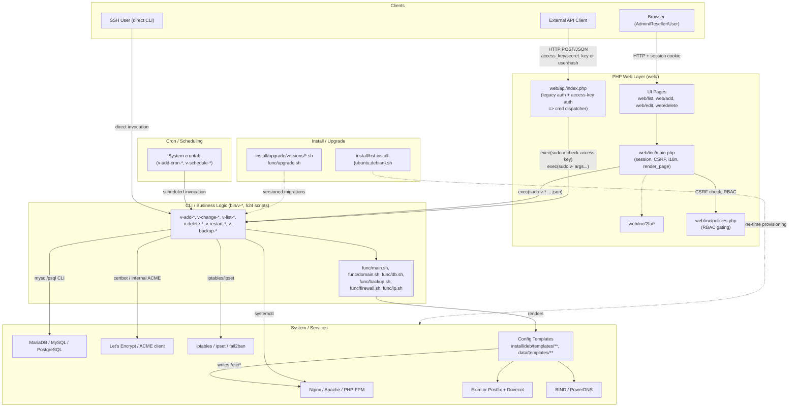
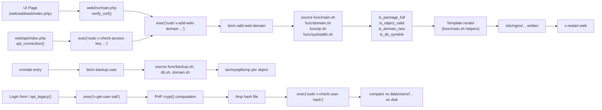
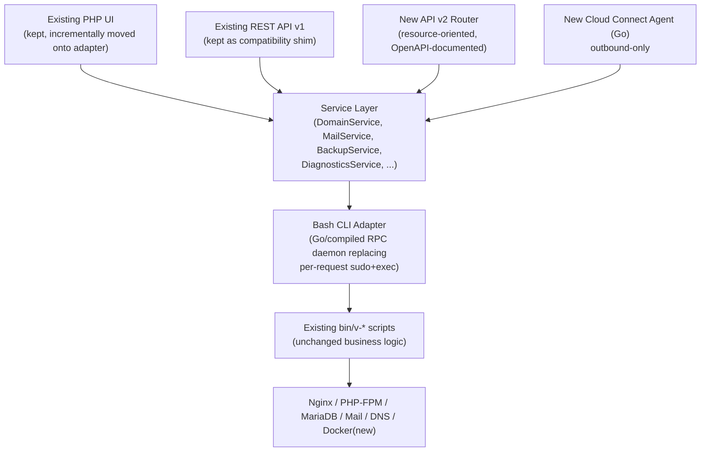

# Hestia Control Panel — Architecture Review

Analysis-only document. No source files were modified to produce this review. All conclusions are grounded in the current state of this repository at commit `ea163c202` ("Update nano id", branch `main`) unless noted as "Needs further investigation."

---

# Executive Summary

Hestia Control Panel (HestiaCP) is a **Bash-first hosting control panel** with a thin PHP web UI and PHP REST API layered on top. The real "business logic" — validation, state mutation, service configuration, quota/package enforcement — lives almost entirely in `bin/v-*` Bash scripts and the shared function libraries in `func/*.sh`. PHP is a *presentation and transport* layer: every meaningful action in the web UI and the REST API resolves to `exec("sudo /usr/local/hestia/bin/v-<verb>-<noun> ...")` and parses the stdout (`web/inc/main.php:246`, `web/api/index.php:190`, `web/api/index.php:315`).

This is not an accident of neglect — it is a deliberate, load-bearing design:

- `bin/v-*` scripts are also the **admin-facing CLI** (SSH users run `v-add-web-domain` directly), so PHP cannot bypass them without creating two divergent code paths.
- Config generation is template-driven Bash (`.tpl`/`.stpl` files under `install/deb/templates/**` and `data/templates/**`) executed via `func/main.sh`'s template-rendering helpers.
- Privilege separation runs through `sudo` + PAM-style hashing (`v-check-user-password`, `v-check-user-hash`) rather than a persistent privileged daemon.

**What this means for evolving the panel:**

1. A ground-up rewrite is not justified by the evidence — the Bash layer is mature, heavily used as a CLI in its own right, and encodes years of edge-case handling (idempotency checks, race-condition guards, IDN handling, package/quota enforcement).
2. A proper **API v2** is *feasible without a rewrite* by formalizing the existing `bin/v-*` scripts as the stable contract and building a real service/adapter layer in front of them (see § API v2 Analysis), rather than shelling straight out from HTTP request handlers as today's `web/api/index.php` does.
3. The biggest architectural liabilities are **not** "Bash is used at all" — they are: (a) shelling out from the HTTP-facing PHP process for every single action (no batching, no async, no structured errors beyond stdout text), (b) JSON-as-a-flag output convention (`... json` as a literal trailing CLI argument) instead of a real machine-readable protocol, and (c) tight coupling between UI session state, config files on disk, and CLI script side effects, which makes horizontal scaling and true multi-tenancy hard.
4. Go (or any compiled backend) has a real, narrow role: a supervising **agent/API daemon** that replaces the "PHP shells out to sudo Bash per request" pattern with structured RPC — not a rewrite of `bin/v-*` business logic itself, most of which should be wrapped, not replaced.

---

# Current Architecture

## Components identified

| Layer | Location | Role |
|---|---|---|
| **UI (server-rendered)** | `web/templates/**`, `web/list`, `web/add`, `web/edit`, `web/delete`, `web/js/**` | PHP templates + Alpine.js/vanilla JS for the admin/reseller/user web panel |
| **PHP glue / session / auth** | `web/inc/main.php`, `web/inc/helpers.php`, `web/inc/prevent_csrf.php`, `web/inc/policies.php`, `web/inc/2fa/*`, `web/inc/secure_login.php` | Session bootstrap, CSRF, RBAC policy include, 2FA verification, i18n |
| **REST API** | `web/api/index.php` (single file, 394 lines) | Legacy user/pass or API-key (`access_key`/`secret_key`) auth, then shells out to `bin/v-*` |
| **CLI ("business logic")** | `bin/v-*` (524 scripts) | The actual implementation: validation, state changes, service reconfiguration |
| **Shared Bash libraries** | `func/main.sh` (2133 lines), `func/domain.sh`, `func/db.sh`, `func/backup.sh`, `func/firewall.sh`, `func/ip.sh`, `func/rebuild.sh`, `func/remote.sh`, `func/syshealth.sh`, `func/upgrade.sh`, `func/internal/*` | Validation (`is_object_valid`, `is_format_valid`), config parsing (`source_conf`), logging, template rendering, error codes |
| **Configuration generation** | `install/deb/templates/**` (`.tpl`/`.stpl`), user-writable overrides under `data/templates/**` (runtime, not in this repo tree) | Nginx/Apache/PHP-FPM/Exim/Dovecot/DNS zone/etc. config templates rendered by Bash into `/etc/*` |
| **Service management** | `bin/v-restart-*`, `bin/v-start-service`, `bin/v-stop-service`, `func/main.sh` service helpers | Wraps `systemctl`/`service` per distro |
| **Database access** | `func/db.sh`, `bin/v-*database*` | Shells to `mysql`/`psql` CLI clients; no ORM, no persistent DB connection pool |
| **Authentication** | `bin/v-check-user-password`, `bin/v-check-user-hash`, `bin/v-check-access-key`, `bin/v-generate-password-hash`, crypt-compatible hashing (md5/sha-512/yescrypt/des) | Password/hash verification is done by Bash (crypt-hash chain in PHP for legacy API, hash comparisons in Bash for CLI/API-key path) |
| **Authorization** | `web/inc/policies.php`, `$_SESSION["ROLE"]`/`userContext`, `USER_ARG_POSITION` check in `web/api/index.php:301-312`, per-key command allowlists in `v-check-access-key` | Role-based (admin/reseller/user) + API key scoped to specific commands/users |
| **Cron / background jobs** | `bin/v-add-cron-*`, `bin/v-schedule-*`, system crontab management, RRD stat collection (`v-update-sys-rrd-*`) | System crontab entries invoke `v-*` scripts on schedule (backups, Let's Encrypt renewal, stats, queue) |
| **Installation** | `install/hst-install.sh` (dispatcher, 139 lines), `install/hst-install-ubuntu.sh` (2587 lines), `install/hst-install-debian.sh` (2580 lines), `install/common/*`, `install/deb/*` (per-service config/package trees) | Monolithic, distro-specific, sequential Bash installers that apt-install packages and lay down template configs |
| **Update/upgrade system** | `func/upgrade.sh`, `install/upgrade/versions/*.sh` (one script per released version), `install/upgrade/upgrade.conf`, `install/upgrade/manual/*`, `bin/v-update-sys-hestia*` | Versioned migration scripts applied sequentially, similar in spirit to DB migrations but for system state |

## How components communicate

The dominant communication pattern, confirmed by direct code inspection, is **process-exec with text/JSON stdout parsing** at every layer boundary:

- **Browser → PHP UI**: standard HTTP form posts / fetch calls to `web/**` pages; session cookie auth (`web/inc/main.php:2` `session_start()`), CSRF token compared in `verify_csrf()` (`web/inc/main.php:204`).
- **PHP UI → CLI**: `exec(HESTIA_CMD . "v-list-user " . $user . " json", $output, $return_var)` (`web/inc/main.php:246`) — `HESTIA_CMD` is literally `"/usr/bin/sudo /usr/local/hestia/bin/"` (`web/inc/main.php:21`). Every list/add/edit/delete page in `web/list`, `web/add`, `web/edit`, `web/delete` follows this pattern.
- **External API client → REST API → CLI**: `web/api/index.php` parses either legacy (`user`/`password`/`hash`) or access-key (`access_key`/`secret_key`) credentials, authenticates by shelling to `v-check-user-hash`/`v-check-access-key`, then builds `$cmdquery = HESTIA_CMD . escapeshellcmd($hst_cmd)` and appends `quoteshellarg()`-escaped positional args (`web/api/index.php:190-198`, `:314-320`). The API is a **pass-through command dispatcher**, not a resource-oriented REST design — `cmd` is a literal CLI verb name.
- **CLI → CLI**: `bin/v-add-web-domain` and most `v-add-*`/`v-change-*` scripts call other `bin/v-*` scripts directly as subprocesses (e.g. `$BIN/v-list-web-domain ...`) rather than sharing code as libraries beyond the common `func/*.sh` sourcing.
- **CLI → system**: `func/main.sh` and per-domain scripts shell to `systemctl`, `mysql`/`psql`, `certbot`/internal ACME client, `idn2`, `openssl`, iptables/ipset (`bin/v-add-firewall-*`), and write template-rendered files into `/etc/nginx`, `/etc/apache2`, `/etc/php/*/fpm`, `/etc/exim4` or `/etc/postfix`, `/etc/dovecot`, `/etc/bind` or PowerDNS.
- **Cron → CLI**: crontab entries invoke `v-*` scripts exactly as a human admin would over SSH — there is no separate "internal" invocation path.

**Key structural fact**: PHP never talks to the system directly (no direct file writes to `/etc`, no direct DB connections for tenant data, no direct systemctl calls) — every privileged action funnels through `sudo` + a `bin/v-*` script. This is a genuine security boundary (sudo policy limits what the web user can invoke) but it also means **PHP has zero business logic of its own** for control-plane operations; it is a UI shell around the CLI.

## Architecture Diagram



---

# Subsystem Analysis

For each subsystem: source dirs, entry points, dependencies, generated config, external deps, coupling.

### Web / Nginx
- **Dirs**: `install/deb/templates/web/nginx/*.tpl,*.stpl`, `install/deb/nginx/`
- **Entry points**: `bin/v-add-web-domain`, `bin/v-add-web-domain-backend`, `bin/v-rebuild-web-domains`, `bin/v-update-sys-web-config` family
- **Config generated**: vhost files (`hosting.stpl`, `suspended.stpl`, proxy templates) rendered into `/etc/nginx/conf.d`/`sites-available` equivalents
- **External deps**: `nginx` binary, `systemctl`
- **Coupling**: High to PHP-FPM (backend template selection, see `backendtpl_with_webdomains()` in `web/inc/main.php:535`), high to SSL (cert paths injected into templates), high to DNS (auto-created web-alias DNS records via `v-add-dns-on-web-alias`)

### Apache
- **Dirs**: `install/deb/templates/web/` (Apache templates alongside Nginx templates; exact per-file inventory not separately enumerated — **Needs further investigation**)
- **Entry points**: same `v-add-web-domain`/`v-rebuild-web-domains` family with `WEB_SYSTEM=apache2` branch logic in `func/main.sh`
- **Coupling**: Same axis as Nginx; Hestia supports Nginx-only, Apache-only, or Nginx-as-reverse-proxy-to-Apache — this triples the template combinations that must stay in sync

### PHP / PHP-FPM
- **Dirs**: `install/deb/php-fpm/`, pool templates under `install/deb/templates`
- **Entry points**: `bin/v-add-web-domain` (BACKEND arg), `bin/v-change-web-domain-backend` (naming pattern; exact script confirmed via `web-domain-backend-tpl` command family), `bin/v-list-sys-php`
- **Config generated**: per-domain FPM pool files, backend template selection stored in `web.conf` per user (`BACKEND=` key, read by `backendtpl_with_webdomains()`)
- **Coupling**: Tight to Web/Nginx (pool socket path baked into vhost template) and to Packages (PHP version limits per package)

### DNS
- **Dirs**: `bin/v-add-dns-*`, `bin/v-*-remote-dns-*` (DNS cluster sync), `install/deb/bind` or PowerDNS equivalents
- **Entry points**: `v-add-dns-domain`, `v-add-dns-record`, `v-rebuild-dns-domains`, `v-sync-dns-cluster`
- **Config generated**: zone files, `named.conf`/PowerDNS backend records
- **External deps**: BIND9 or PowerDNS, `rndc`
- **Coupling**: Loosely coupled to Web (auto-alias creation is the main cross-link); DNS cluster sync (`v-sync-dns-cluster`, `v-add-remote-dns-host`) is a **distinct multi-server feature already in the codebase** — directly relevant to future Cloud Connect design (see § Cloud Connect)

### Mail / Exim / Postfix / Dovecot
- **Dirs**: `install/deb/exim/`, mail templates under `install/deb/templates/mail`
- **Entry points**: `bin/v-add-mail-domain`, `bin/v-add-mail-account`, `bin/v-add-mail-domain-dkim`, `bin/v-add-mail-domain-antispam/antivirus`
- **External deps**: Exim or Postfix, Dovecot, SpamAssassin/rspamd, ClamAV (`install/deb/clamav`), Roundcube/SnappyMail (`bin/v-add-sys-roundcube`, `sys-snappymail`)
- **Coupling**: High internal complexity (DKIM key generation, SPF/DMARC-adjacent DNS record creation ties Mail → DNS), moderate coupling to Web (webmail proxy config touches Nginx)

### MariaDB / Databases
- **Dirs**: `func/db.sh`, `install/deb/mysql`, `install/deb/postgresql`
- **Entry points**: `bin/v-add-database`, `bin/v-add-database-host`, `bin/v-dump-database`
- **Access pattern**: shells to `mysql`/`psql` CLI with credentials passed via CLI args or temp files — **no persistent connection, no ORM**
- **Coupling**: Low-to-moderate; database host abstraction (`v-add-database-host`) already models "multiple DB servers per panel," which is a useful precedent for future multi-backend backup/storage abstractions

### SSL / Let's Encrypt
- **Dirs**: `bin/v-add-letsencrypt-*`, `install/deb/ssl`
- **Entry points**: `v-add-letsencrypt-domain`, `v-add-letsencrypt-host`, `v-add-cron-letsencrypt-job`
- **External deps**: ACME client — exact implementation (internal client vs. certbot) **Needs further investigation**, not confirmed by directory listing alone
- **Coupling**: High to Web (cert paths in vhost templates) and Mail (STARTTLS cert paths); renewal is cron-driven, independent of user action — a good candidate for the future Diagnostics subsystem (expiry checks)

### Users / Resellers / Packages
- **Dirs**: `bin/v-add-user`, `bin/v-change-user-package`/`v-rename-user-package`, templates in `data/packages` (runtime, not in repo)
- **Entry points**: `v-add-user`, `v-change-user-package`, `v-list-user-package`
- **Coupling**: This is the **central hot spot** — package limits (`is_package_full 'WEB_DOMAINS'` seen in `bin/v-add-web-domain:59`) are checked by nearly every `v-add-*` script, meaning package/quota logic is duplicated as a *call pattern* across ~80+ `add` scripts rather than centralized in one place beyond the shared `func/main.sh` helper functions

### Backups
See dedicated § Backup Analysis.

### Firewall / Security
- **Dirs**: `bin/v-add-firewall-*`, `install/deb/fail2ban`
- **Entry points**: `v-add-firewall-rule`, `v-add-firewall-ban`, `v-add-firewall-ipset`
- **External deps**: iptables/ipset, fail2ban
- **Coupling**: Low — firewall subsystem is comparatively self-contained, a good "wrap first" candidate

### Cron
- **Dirs**: `bin/v-add-cron-job`, `bin/v-add-cron-hestia-autoupdate`, `bin/v-add-cron-reports`, `bin/v-add-cron-restart-job`
- **Entry points**: writes to the system crontab (`v-add-cron-hestia-autoupdate` greps `/var/spool/cron/crontabs/hestiaweb` to check for existing entries, confirming this file as the target)
- **Coupling**: Every scheduled subsystem (backups, Let's Encrypt renewal, stats/RRD collection, auto-update) depends on this; it is infrastructure, not a "business" subsystem

### Statistics
- **Dirs**: `bin/v-update-sys-rrd-*`, `bin/v-export-rrd`, `web/list/stats`, `web/list/rrd`
- **External deps**: RRDtool
- **Coupling**: Read-heavy, low write coupling — good API v2 candidate (`/servers/{id}/stats`)

### File manager
- **Dirs**: `install/deb/filemanager/filegator`, `bin/v-add-sys-filemanager`
- **Coupling**: Third-party project (Filegator) vendored/installed, not native Hestia code — **Needs further investigation** into upstream licensing/version pinning strategy

### Service management
- **Dirs**: `bin/v-restart-*`, `bin/v-start-service`, `bin/v-stop-service`, `func/main.sh`
- **Coupling**: Every config-generating subsystem calls into this after writing files (`v-restart-web`, `v-restart-mail`, etc.) — it is the "apply" step of the templating system and is itself distro-abstracted (systemd vs sysvinit differences handled in `func/main.sh`)

### Updates
- See § Update/upgrade system above and § Roadmap.

### Installation
- **Dirs**: `install/hst-install.sh`, `install/hst-install-{ubuntu,debian}.sh`, `install/common/`, `install/deb/`
- **Structure**: `hst-install.sh` is a thin OS-detection dispatcher (139 lines) that execs the distro-specific 2500+-line installer. These installers are **monolithic, imperative, largely non-idempotent** scripts that apt-install packages, write initial configs from the same template tree used at runtime, and create the initial admin user.
- **Coupling**: Extremely high internal coupling by necessity (order-dependent: create hestia user → install packages → configure each service → start services), but low coupling to the rest of the *runtime* codebase beyond sharing `install/deb/templates` with `func/main.sh`'s template renderer

---

# Bash Dependency Analysis

**143 Bash files** are tracked by the code-graph index, plus the two ~2500-line installer scripts and `func/main.sh` at 2133 lines — this is the true core of the project by both line count and functional weight (319 PHP files exist, but the PHP is comparatively thin per-file: `web/api/index.php` is 394 lines and is the *entire* REST API).

## Classification

**A. System orchestration** — `func/main.sh` service-start/stop wrappers, `install/hst-install-*.sh`, `func/upgrade.sh`. Sequences multi-step provisioning; inherently procedural, appropriately Bash.

**B. Business logic** — the bulk of `bin/v-add-*`/`v-change-*`/`v-delete-*`. Example: `bin/v-add-web-domain` (lines 59-77) enforces package quotas, uniqueness across IDN/ASCII domain forms, symlink-attack checks (`is_dir_symlink`), and domain ownership rules — this is genuine domain logic, not just command wrapping. **This is the largest and most consequential category.**

**C. Configuration generation** — template rendering functions in `func/main.sh` that substitute variables into `.tpl`/`.stpl` files under `install/deb/templates/**`. Pure data transformation; could be reimplemented in any language, but there is no evidence today's version has correctness problems that would justify the churn.

**D. Service management** — `v-restart-*`, `v-start-service`, `v-stop-service`. Thin wrappers around `systemctl`. Fine as-is; low complexity, low risk.

**E. Wrappers around Linux commands** — `mysql`/`psql` invocation in `func/db.sh`, `iptables`/`ipset` calls in firewall scripts, `idn2`/`openssl` calls. Idiomatic use of Bash as glue.

**F. Legacy implementation** — the crypt-hash method fallback chain in `web/inc/main.php:99-129` (md5 → sha-512 → yescrypt → des) and matching Bash-side hash verification in `bin/v-check-user-password`. Multiple hash schemes coexist for backward compatibility with accounts created under older Hestia versions — legacy by design, must stay for existing installs but shouldn't be extended.

**G. Logic that should potentially move into a compiled backend** — *not* the validation/business logic itself, but the **per-HTTP-request process-spawn pattern**: every UI page load and every API call pays full `fork()+exec()+sudo` overhead (`web/inc/main.php:246`, `web/api/index.php:198,330`) with no connection reuse, no batching of related calls (e.g., listing users then listing each user's domains in `backendtpl_with_webdomains()` does N+1 `exec()` calls, `web/inc/main.php:536-563`), and no structured error channel beyond parsing stdout text/JSON. A compiled daemon that keeps `bin/v-*` scripts as its execution backend but exposes structured RPC/HTTP would remove this overhead without touching business logic.

**H. Bash that should probably remain Bash** — package management (`apt`), systemd control, file permission (`chown`/`chmod`) operations, template rendering for well-understood, rarely-changing config formats (Nginx/Exim/Dovecot syntax). These are exactly what Bash is good at and rewriting them buys nothing.

## Execution chains (most important)

```
1. Web UI add-domain:
   Browser → web/add/web/index.php → verify_csrf() → exec("sudo v-add-web-domain ...")
   → bin/v-add-web-domain → source func/main.sh,domain.sh,ip.sh,syshealth.sh
   → is_package_full, is_object_valid, is_domain_new (validation)
   → template render (func/main.sh) → /etc/nginx/... written
   → v-restart-web (service reload)

2. REST API call:
   HTTP POST {access_key, secret_key, cmd, arg1..} → web/api/index.php:api_connection()
   → exec("sudo v-check-access-key ...") [auth + per-key command allowlist]
   → exec("sudo v-<cmd> <args>") → same bin/v-* execution as #1
   → stdout captured, JSON-detected via json_decode() probe, HTTP response built

3. Cron-driven backup:
   crontab (installed by v-add-cron-job) → bin/v-backup-user
   → source func/main.sh,domain.sh,db.sh,backup.sh
   → per-object (web/mail/db/user config) tar/dump into backup archive
   → (restic variant: bin/v-backup-user-restic → restic CLI subprocess)

4. Auth (legacy password path):
   web/inc/main.php session bootstrap → api_legacy() [API] or login form [UI]
   → exec("v-get-user-salt") → PHP-side crypt() hash computation
   → hash written to /tmp file → exec("sudo v-check-user-hash", hashfile)
   → bin/v-check-user-hash compares against on-disk hash under /usr/local/hestia/data/users/<user>/
```

## Dependency / execution-flow diagram



---

# Dependency Map

- **UI → CLI**: one-directional, per-request, always via `sudo`. No CLI script calls back into PHP.
- **CLI → CLI**: scripts source shared `func/*.sh` libraries and directly invoke other `bin/v-*` scripts as subprocesses (e.g., `v-add-web-domain` calls `v-list-web-domain` to check pre-existing state). This is essentially **shell-level function composition without a shared in-process runtime** — every cross-script call pays subprocess overhead.
- **Shared state**: flat-file "database" under `/usr/local/hestia/data/{users,ips,queue}` and per-user config files (`web.conf`, `mail.conf`, `dns.conf`, `backup-excludes.conf`) parsed with `grep`/`awk` (seen directly in `bin/v-backup-user:36-46`). This is the single biggest coupling point: **many scripts read and write the same flat config files with no locking abstraction visible in the sampled code** — concurrent operations on the same user are a plausible race-condition source. **Needs further investigation**: whether `func/main.sh` provides any file-locking primitive used consistently (not observed in the sampled scripts).
- **Config file overlap**: Web, Mail, DNS, and Backup subsystems all read `USER_DATA`-relative conf files (`web.conf`, `mail.conf`, `backup-excludes.conf`) — a schema change to one of these flat files has blast radius across every subsystem that parses it with positional `grep`/`awk`, since there is no schema/version negotiation.
- **Safe to isolate**: Firewall, Statistics/RRD, File manager (Filegator is already a separate vendored app) — these have narrow, mostly one-directional dependencies on the rest of the system.
- **Highly coupled ("hot spots")**:
  1. **`func/main.sh`** — sourced by virtually every `bin/v-*` script; a behavior change here has system-wide blast radius (confirmed: it defines `source_conf`, validation primitives `is_object_valid`/`is_format_valid`, and constants like `E_INVALID` referenced throughout `bin/*`).
  2. **User/package quota checks** (`is_package_full`) — duplicated call-site pattern across ~80+ `add`-verb scripts rather than centralized; changing quota semantics means touching many files.
  3. **Flat-file config parsing** (`USER_DATA/*.conf`) — read by Web, Mail, DNS, Backup, Stats subsystems via ad hoc `grep`/`awk`, with no shared parser/schema.
  4. **`HESTIA_CMD` sudo-exec pattern in PHP** — both `web/inc/main.php` and `web/api/index.php` independently hardcode `HESTIA_CMD`/`HESTIA_DIR_BIN` and independently implement JSON-decode-of-stdout parsing; there is no shared PHP client library wrapping this (each caller re-implements `exec()` + `json_decode(implode(...))`).

---

# API v2 Analysis

## Current API architecture

`web/api/index.php` is a **command-dispatch proxy**, not a resource-oriented API:
- Auth: legacy (`user`+`password`, or `hash`) or access-key (`access_key`+`secret_key`), the latter scoped per-key to specific commands and optionally a specific `arg` position that must equal the key's owning user (`web/api/index.php:290-312`) — i.e., **fine-grained authorization already exists**, but is expressed as "which CLI verb + which argument index," not as REST resource/action semantics.
- Request shape: `cmd=v-add-web-domain&arg1=...&arg2=...` (or JSON body with the same keys) — the API surface is *literally* the CLI surface, positionally.
- Response shape: raw CLI stdout, optionally JSON if `json` is passed as a literal trailing arg by the caller and the output happens to parse as JSON (`web/api/index.php:345`). There's no OpenAPI-style contract; the shape of a given command's output depends entirely on that script's own ad hoc list-formatting function (e.g. `json_list()` in `bin/v-check-access-key`).

## What can be exposed immediately

- Read-heavy resources with `... json` output already implemented and stable across many scripts: `sys-services`, `web-domains`, `dns-domains`, `mail-domains`, `databases`, `users`, `packages`, `sys-config` — these could be fronted by a v2 router with minimal risk since the underlying CLI already returns structured JSON.
- Access-key auth model is already resource/action-scoped and can be reused as-is for v2's authorization model.

## What requires refactoring

- **Response contracts** are inconsistent across the 524 scripts (JSON shape is whatever each script's ad hoc list-formatting logic produces) — v2 needs a canonical response envelope and either a compatibility-mapping layer or a push to standardize `v-list-*` JSON output shapes.
- **Error handling** is exit-code + stdout text (`E_INVALID`, `E_FORBIDEN` [sic, confirmed spelling in `func/main.sh`'s reserved-variable list] etc., mapped to HTTP codes via `exit_code_to_http_code()` in `web/inc/helpers.php` — full mapping table not read in this pass, **Needs further investigation**). A v2 needs a stable, documented error-code contract, which the E_* constants in `func/main.sh` already provide a foundation for.
- **N+1 exec patterns** like `backendtpl_with_webdomains()` (`web/inc/main.php:535-565`, one `exec()` per user to list their domains) need batching primitives in the CLI layer (e.g., a `v-list-all-web-domains` that returns everything in one call) before a v2 API can offer efficient list endpoints.

## What requires new service abstractions

- A **command-to-resource mapping layer** (service layer, see next section) that translates `GET /domains/{id}` into the correct `v-list-web-domain` invocation, independent of the CLI's positional-argument shape — this decouples the public API contract from CLI script signatures, which is important because CLI signatures are also a stable *user-facing* interface (SSH admins depend on them) and can't be freely redesigned for API convenience.
- A **structured RPC transport to replace repeated `sudo`+`exec()`** — see § Service Layer and § Go vs Existing Architecture.

## What currently depends too heavily on CLI/Bash

- Anything requiring **transactional multi-step operations** (e.g., "create domain + provision SSL + add DNS record, roll back all three on any failure") — today each `v-add-*` script is independently transactional at best (internal rollback on its own failure) but there is no cross-script transaction/saga concept. A v2 API that wants atomic multi-resource operations needs an orchestration layer that does not exist today.
- **Long-running operations** (backups, Let's Encrypt issuance, large restores) are currently synchronous CLI invocations; a v2 API needs async job semantics (job ID + polling or webhook) that must be built new — `bin/v-schedule-*` scripts hint at an existing async pattern (cron-deferred execution) that could be generalized.

## Minimum architecture required for API v2

1. A stable **command registry** describing each `v-*` script's arguments, output schema, and required role/permission (could be generated by introspecting the `# options:` header comments already present in every script, e.g. `bin/v-add-web-domain:2` — this metadata already exists as documentation and could become machine-readable).
2. A **thin RPC/service process** (candidate for Go — see below) that owns the `sudo`+`exec()` boundary, exposes structured request/response (gRPC or JSON-HTTP) instead of raw stdout parsing, and can batch/cache reads.
3. A **resource router** mapping REST verbs/paths to command-registry entries, with a v1-compatible passthrough mode during migration (so `web/api/index.php`'s existing contract keeps working).
4. An **async job model** for long-running operations, backed by the existing cron/schedule mechanism as a first implementation, replaceable later.

Proposed v2 resources, grounded in the existing `bin/v-*` verb-noun taxonomy surveyed in this repo: `/users`, `/resellers` (role-filtered users), `/packages`, `/domains` (web), `/domains/{id}/aliases`, `/dns/zones`, `/dns/zones/{id}/records`, `/mail/domains`, `/mail/accounts`, `/databases`, `/database-hosts`, `/ssl/certificates`, `/backups`, `/backup-hosts`, `/firewall/rules`, `/firewall/bans`, `/cron/jobs`, `/services`, `/servers` (self + DNS-cluster remote hosts, and future Cloud Connect fleet).

---

# Service Layer Analysis

## Proposed shape

```
UI / API v2
   ↓
Service Layer  (per-domain: DomainService, MailService, DatabaseService, BackupService, ...)
   ↓
Provider / Adapter  (BashCliAdapter today; possible native adapters later)
   ↓
bin/v-* scripts → Nginx / PHP-FPM / MariaDB / Mail / DNS
```

## Critique — is this the right architecture?

**Where it's justified:**
- It directly addresses the confirmed hot spot of *ad hoc, duplicated* `exec()`+`json_decode()` call sites scattered across `web/inc/main.php` and `web/api/index.php` — centralizing this into one adapter removes duplication without touching `bin/v-*` at all (zero risk to the CLI, which must stay stable for SSH users).
- It gives API v2 a stable seam: the router talks to services, services talk to the adapter, and the adapter is the *only* thing that needs to change if the execution mechanism evolves (e.g., from `exec()` to a Go RPC daemon).
- Domains that clearly warrant a service abstraction: **Users/Packages** (quota logic duplicated across scripts — a `PackageService.checkQuota()` centralizes it once, even while still shelling to Bash underneath), **Backups** (multiple divergent implementations already exist — legacy tar-based vs restic-based, see § Backup Analysis — a `BackupService` with pluggable providers is close to necessary regardless of Docker/API work), **DNS** (cluster sync already exists as a distinct concern and maps naturally to a service boundary).

**Where it would be unnecessary complexity:**
- **Firewall, Cron, Statistics** are narrow, mostly single-script-per-action subsystems today; wrapping them in a full service+adapter+provider stack adds indirection with little payoff until/unless they need to support multiple backends (e.g., statistics moving from RRDtool to Prometheus would justify a `StatsProvider` interface, but that's not evidenced as a near-term need).
- Introducing the full four-layer stack **before** API v2 has concrete consumers risks over-engineering: the adapter layer is justified today (removes real duplication); the "Provider" abstraction (multiple interchangeable backends per domain) is only clearly justified for Backups and, longer-term, Docker (§ Docker Analysis) — elsewhere it should wait until a second real backend exists, per YAGNI.
- Scripts that should "eventually be rewritten" behind the adapter are not the `v-add-*`/`v-change-*` validation-heavy scripts (rewriting those risks reintroducing bugs the Bash already handles, e.g., IDN domain handling, symlink-attack checks in `v-add-web-domain`) — they should stay wrapped indefinitely unless a specific correctness or performance problem is found.

**Recommendation**: build the **adapter layer first and only** (BashCliAdapter), prove it out by migrating `web/inc/main.php`'s and `web/api/index.php`'s `exec()` call sites onto it, and defer the full service/provider abstraction until API v2 or Backup-provider work concretely needs it. Building the whole stack up front for subsystems with one backend and no near-term second backend is the "unnecessary complexity" case explicitly asked about.

---

# Go vs Existing Architecture

Per-subsystem classification (KEEP AS-IS / WRAP-ADAPTER / REWRITE LATER / REPLACE):

| Subsystem | Classification | Reasoning |
|---|---|---|
| `bin/v-*` validation & business logic (users, domains, mail, DNS, DB CRUD) | **KEEP AS-IS** | Mature, exercised as both API backend and admin CLI; correctness risk of rewriting (IDN handling, quota edge cases, symlink checks) outweighs any Go benefit. Evidence: `bin/v-add-web-domain` alone has ~7 distinct validation calls before doing any work. |
| Config template rendering (`func/main.sh` template helpers, `.tpl`/`.stpl` files) | **KEEP AS-IS** | Correct, low-churn, format-specific; a Go templating rewrite buys nothing observable. |
| Service start/stop/restart wrappers | **KEEP AS-IS** | Thin `systemctl` wrappers; no complexity to reduce. |
| **PHP→Bash exec boundary** (`web/inc/main.php`, `web/api/index.php`) | **REPLACE** (with a Go/compiled RPC daemon in front of the *same* `bin/v-*` scripts) | This is the actual pain point: per-request `sudo`+`fork`+`exec`, N+1 patterns, no batching, no structured errors, duplicated auth logic between the two PHP entry points. A Go daemon exposing gRPC/JSON-RPC that internally still calls `bin/v-*` removes the overhead without touching business logic. |
| REST API v2 router/resource layer | **REPLACE** (new build, in Go or PHP — language choice secondary to the design work in § API v2 Analysis) | Doesn't exist as resource-oriented today; must be built new regardless of language. |
| Backup format/orchestration | **REWRITE LATER** (new provider-abstraction layer; existing tar and restic implementations wrapped as providers, not deleted) | Two divergent implementations already exist (`v-backup-user` tar-based, `v-backup-user-restic`); consolidating behind a common interface is worth doing before adding S3/R2/MinIO/SFTP targets, per § Backup Analysis. |
| Docker/Compose support | **NEW** (not a classification of existing code — this is greenfield; see § Docker Analysis) | No Docker-related code found in `bin/*` or `func/*` in this survey. |
| Diagnostics/repair | **NEW** | No dedicated diagnostics subsystem found; would consume the same `bin/v-list-*`/`bin/v-*-status` scripts already present (`sys-nginx-config`, `sys-dovecot-config`, `sys-db-status`, etc. — confirmed present in `bin/` naming survey) as data sources. A Go daemon is a reasonable home for this since it benefits from concurrency (checking N services in parallel) and structured health output — a genuine Go advantage over sequential Bash checks. |
| Cloud Connect agent | **NEW**, and the strongest case for Go of anything in this review | Needs a long-lived, secure outbound connection (avoiding inbound exposure per the user's explicit requirement), concurrent multi-server fleet handling, and TLS/mTLS — this is squarely in Go's wheelhouse and has no meaningful existing implementation to preserve (DNS cluster sync, `v-sync-dns-cluster`, is the closest precedent but is HTTP/API-based polling between panels, not an agent architecture). |
| Installer (`install/hst-install-*.sh`) | **KEEP AS-IS**, with **WRAP** for idempotency/observability improvements later | Rewriting a 2500-line, well-exercised, distro-specific bootstrap script in Go to run *once* per server has poor ROI; if anything, wrap it with better logging/resumability rather than replace it. |

**Where Go provides a real architectural advantage**: anywhere the current design pays repeated process-spawn overhead for structured, concurrent, or long-lived work — the API/RPC boundary, diagnostics (parallel service checks), and Cloud Connect (persistent secure connections, fleet concurrency). **Where Bash/PHP remains the better choice**: anywhere the value is in an already-correct, rarely-changing, sequential script that either (a) doubles as a user-facing CLI contract or (b) is a one-time/rare-event script (installer, version-upgrade migrations).

---

# Backup Analysis

## Current implementation

Two parallel implementations exist in the repository:
1. **Legacy tar/dump-based** (`bin/v-backup-user`, 800 lines): reads `USER_DATA/backup-excludes.conf` (parsed with `grep`+`awk` for `WEB=`, `MAIL=`, `DB=`, `USER=` exclusion lists — confirmed in `bin/v-backup-user:36-46`), computes per-object disk usage, and produces a backup archive covering web files, mail, databases (via `func/db.sh` dump helpers), and user/domain configuration.
2. **Restic-based** (`bin/v-backup-user-restic`, 117 lines, plus `v-add-backup-host-restic`, `v-list-user-backup-restic`, etc.): thin wrapper delegating snapshotting, encryption, deduplication, and incrementality to the `restic` binary and its native repository backends.

The restic path already gives Hestia **encryption, deduplication, incremental backups, and (via restic's own backend support) S3-compatible storage** for free at the tool level — restic natively supports S3, Backblaze B2, and (via the S3-compatible endpoint mode) R2 and MinIO, and SFTP. This is the most direct, lowest-risk path to most of the storage targets requested (S3, S3-compatible, R2, MinIO, SFTP) — **it may already substantially work today by pointing restic's repository URL at those backends; this needs runtime verification** (**Needs further investigation**: whether Hestia's restic wrapper scripts currently expose repository-URL configuration for non-local backends, or hardcode a local/`v-add-backup-host-restic`-defined target).

FTP support is not native to restic and would need a custom provider (e.g., via `rclone` as an intermediary, or a dedicated FTP uploader) regardless of architecture chosen.

## Evaluation against requested capabilities

| Requirement | Legacy tar path | Restic path | Gap |
|---|---|---|---|
| Local backups | Yes (native) | Yes (native) | None |
| S3 / S3-compatible / R2 / MinIO | No | Likely yes via restic's S3 backend — **needs verification of current wrapper config exposure** | Wrapper/config surface may need extending, not core rewrite |
| SFTP | No | Yes, restic supports SFTP repos | Same as above |
| FTP | No | No (not a restic-native backend) | Needs a new provider (rclone-based or custom) regardless of path chosen |
| Encryption | Not evidenced in tar path | Yes, restic encrypts by default | Legacy path has no equivalent — not a gap for restic-forward strategy |
| Incremental / deduplication | No (full tar per run, based on script structure) | Yes, native to restic | Strong argument to deprecate tar path over time |
| Verification | **Needs further investigation** (not confirmed in either script from this pass) | restic has native `check`/`verify` commands, not confirmed as wired into `v-*-restic` scripts | |
| Granular restore | **Needs further investigation** | restic supports granular restore natively; Hestia wrapper's exposure of this — **not confirmed in this pass** | |
| Scheduling | `v-schedule-user-backup` / `v-schedule-user-backup-restic`, cron-driven | Same | Already supported for both paths |

## Recommended architecture (analysis only, not implementation)

Given two implementations already exist and one (restic) is materially closer to the target feature set:

1. Treat **restic as the primary path forward** and the legacy tar path as the thing to eventually deprecate — not rewritten, just phased out once restic coverage (mail, DB dumps, DNS/config) is confirmed equivalent.
2. Introduce a thin **BackupProvider interface** (per the Service Layer discussion) with `LocalProvider`, `ResticProvider` (parameterized by restic's own backend selection: S3/R2/MinIO/SFTP all map to restic's existing backend config), and a new `FtpProvider`/`RcloneProvider` for FTP-only targets that restic can't reach natively.
3. Confirm (this is flagged as needing investigation, not assumed) whether `v-add-backup-host-restic` already parameterizes the restic repository URL generically enough to support arbitrary S3-compatible endpoints — if so, "supporting R2/MinIO" may be a **documentation and UI exposure task**, not new backend code.

---

# Docker Analysis

No Docker- or container-related code was found in `bin/*`, `func/*`, or `install/*` during this survey (the only "docker" string hits were false positives in `func/syshealth.sh` and DNS/interface listing scripts unrelated to containers — **confirmed no existing Docker integration**).

## Where Docker could integrate without becoming mandatory

Given the existing architecture treats "Web Domain" as the top-level served-content abstraction (vhost + backend template + optional proxy target — evidenced by `v-add-web-domain`'s `PROXY_EXTENSIONS` argument and the existing `web-domain-proxy`/`web-domain-backend-tpl` command family), Docker support fits naturally as **a new backend type alongside the existing PHP-FPM/proxy backends**, not a parallel system:

- **Containers as a web-domain backend**: extend the existing "Backend Template" concept (`BACKEND=` in `web.conf`, selected per-domain today between PHP versions) to include a `docker` backend type, where Nginx's existing proxy-template mechanism (already used for `web-domain-proxy`) points at a container's exposed port instead of an upstream app server. This reuses the reverse-proxy integration that already exists rather than inventing new routing.
- **Compose applications**: modeled as a new object type analogous to "Web Domain" but backed by a `docker compose` project directory per user, with its own quota/package accounting (reusing the `PackageService`/quota pattern already used for domains, databases, mail).
- **SSL**: existing Let's Encrypt automation already issues certs independent of backend type (cert issuance is domain-driven, not backend-driver-driven), so it should attach to Docker-backed domains with no new SSL code.
- **Ports**: the existing `sys-port`/IP management scripts (`bin/v-*-sys-port`, `bin/v-*-ip*`) already model port/IP allocation per service — extending this to allocate/track container-exposed ports is additive, not a new subsystem.
- **Volumes, logs, restart policies, resource limits**: no existing equivalent — this is genuinely new surface. Resource limits have a *conceptual* precedent in the package/quota system and in `bin/v-add-sys-cgroups` / `user-cgroup` (cgroups are already referenced in the CLI script naming survey), which is a strong signal that **cgroup-based resource limiting infrastructure may already partially exist** and could be reused for container resource limits — **Needs further investigation** into `bin/v-add-sys-cgroups` and related scripts' current implementation before assuming this needs to be built from scratch.

## Keeping Docker optional

Because the existing architecture already supports multiple backend types per domain (PHP versions, proxy, presumably static), adding "container" as one more backend type — gated behind a system-wide enable-flag analogous to the existing `WEB_SYSTEM`/`CRON_SYSTEM` enable-flags checked via `is_system_enabled` (confirmed pattern in `bin/v-add-web-domain:59`) — is architecturally consistent with how Hestia already makes subsystems optional, and would not force Docker onto traditional hosting installs.

---

# Repair / Diagnostics Analysis

## Feasibility

High. The prerequisite data is largely already exposed as read commands: the CLI naming survey confirms existing status/config-inspection scripts — `sys-nginx-config`, `sys-dovecot-config`, `sys-mysql-config`, `sys-pgsql-config`, `sys-db-status`, `sys-disk-status`, `sys-cpu-status`, `sys-mail-status`, `sys-web-status`, `sys-network-status`, `sys-dns-status`, `sys-services` (all confirmed present under `bin/`). A diagnostics subsystem is largely a **consumer of existing data sources**, not a new data-collection problem.

## What a repair/diagnostics system would need

- **A structured health-check registry**: each check (nginx config test, PHP-FPM pool validity, DNS zone syntax, mail queue health, cert expiry, DB connectivity, permission audits) mapped to one or more existing `v-*-status`/`v-*-config` commands, executed and interpreted centrally.
- **Concurrency**: checking N services/domains in parallel is exactly the kind of workload where a compiled daemon (Go, per § Go vs Existing Architecture) meaningfully outperforms sequential Bash — this is one of the clearer "Go adds real value" cases in this review.
- **A remediation-action registry**: mapping each detected problem to a safe corrective `v-*` command (e.g., cert expired → re-run `v-add-letsencrypt-domain`; permissions wrong → a permission-repair script) — **this repair-action layer does not appear to exist today** and would be new work, though it could reuse the same command-registry concept proposed for API v2 (§ API v2 Analysis, "minimum architecture required").
- **Interfaces needed**: a way to run checks read-only (for a dashboard) vs. apply-fix (privileged, audited) — this maps naturally onto the same RBAC/policy model already in `web/inc/policies.php`.

---

# Migration Analysis

## Feasibility of import tooling from other panels

- **From Hestia itself** (server-to-server or version-to-version): Highest feasibility — the existing flat-file config format (`USER_DATA/*.conf`) is Hestia's own schema, and DNS cluster sync (`v-sync-dns-cluster`, `v-add-remote-dns-host`) already demonstrates cross-server data exchange for at least the DNS subsystem, which is a usable precedent for a broader "export/import user bundle" feature.
- **From cPanel / DirectAdmin / Plesk**: Feasibility is bounded by the *target* side's completeness, not Hestia's — Hestia already has the necessary `v-add-*` primitives to construct users/domains/mail/DB/DNS records from an external source, so the missing piece is purely **import adapters that translate each source panel's export format into calls against Hestia's existing `v-add-*` CLI/API surface** (this is a clean fit for the API v2 resource layer proposed above — an "importer" is just a batch client of the same command registry).
- **What is difficult to extract from other panels**: private keys/secrets (SSH keys, DB passwords, mail passwords are typically not exportable in plaintext from other panels and require credential regeneration + user notification), and *panel-specific* customizations (WHM/cPanel plugins, DirectAdmin custom hooks, Plesk extensions) that have no Hestia equivalent — these would need explicit "unsupported, flagged for manual migration" handling rather than silent best-effort translation.
- **Where migration adapters would need to exist**: as a new, isolated module (per-source-panel adapter, e.g. `migrate/cpanel/*`) that only talks to Hestia through the same command-registry/API v2 surface being proposed anyway — this is a strong argument for building the command registry early, since it pays off for both API v2 and migration tooling simultaneously.

---

# Cloud Connect Integration

## Architectural integration points required locally

Given the user's explicit requirement that **the cloud service must not require exposing the panel's management API directly to the public internet**, the correct shape is an **outbound-only agent**, not an inbound-listening API extension. Relevant existing precedent and gaps:

- **Existing precedent**: DNS cluster sync (`v-sync-dns-cluster`, `bin/v-add-remote-dns-host`) already implements *panel-to-panel* communication for a narrow purpose (DNS record propagation) — worth reading in more depth as a template for auth/trust-establishment patterns Hestia has already solved once (**Needs further investigation**: whether this uses inbound API calls or a different transport — the naming alone doesn't confirm push vs. pull).
- **Server registration**: needs a new local capability to generate/store a cloud-issued server identity (analogous to how access keys already work locally — `bin/v-generate-api-key`/`v-check-access-key` are a directly reusable precedent for credential issuance and scoped-permission checking).
- **Outbound agent connection**: new component — a persistent or polling outbound connection (WebSocket/gRPC-stream/long-poll) from the panel to the cloud control plane. This is the strongest concrete case in this review for a **new Go component**, since it needs to run continuously, hold a secure connection, and execute fleet commands concurrently with local panel operation — none of the existing Bash/PHP stack is built for persistent processes.
- **Remote actions**: should route through the *same* command-registry/service-layer abstraction proposed for API v2 — a Cloud Connect "run this action on server X" message is architecturally identical to a local API v2 request, just arriving over the agent's outbound channel instead of local HTTP. Building API v2's service layer first makes Cloud Connect's remote-action execution close to free.
- **Notifications**: `bin/v-add-user-notification`, `bin/v-acknowledge-user-notification` already exist as a local notification primitive — a plausible integration point for cloud-originated notifications to surface in the existing UI rather than needing new UI surface.
- **Licensing / marketplace entitlements**: no existing precedent found in this repository — genuinely new surface, and out of scope for "local architectural integration points" beyond noting the agent needs a place to cache/enforce entitlement state locally (e.g., feature flags gating package limits or Docker/Compose availability).

## Security posture

- Outbound-only from the panel avoids exposing `web/api/index.php` or any new v2 API to the internet for cloud-management purposes — the agent should hold its own distinct, narrowly-scoped credential (reusing the access-key scoping model already proven in `v-check-access-key`, not the panel's own admin session).
- The existing access-key model's per-command allowlist (`USER_ARG_POSITION` check in `web/api/index.php:301-312`) is a good precedent for scoping what the cloud-issued agent credential can invoke, but was designed for a single trusted party (the panel's own users) issuing keys to themselves — a Cloud Connect trust model needs a distinct issuance/revocation flow (cloud-side issued, remotely revocable) that does not exist today and is new work.

---

# GPL / Repository Considerations

Facts observed directly in the repository (not legal advice):

- **License**: `LICENSE` file is the full text of **GNU GPLv3** ("Copyright (C) 2007 Free Software Foundation, Inc.").
- **Trademark/naming restrictions** are stated in `README.md` under "## Copyright" (distinct from the GPL license text): the names "Hestia Control Panel", "HestiaCP", and the Hestia logo are asserted as the original copyright of hestiacp.com, with explicit restrictions — permitted to use the names in contexts directly related to the project (app itself, community, blog posts); **not** permitted to sell/redistribute under those names or similar derivatives, use the names outside project-related context, or alter the name/logo. This is presented as a **separate restriction layered on top of the GPL code license** — GPLv3 itself does not restrict use of the software under a different name, but the README's naming/trademark restriction is a distinct claim that exists in this repo regardless of the code license.
- **Third-party/vendored code**: `.gitmodules` declares four `bats-core` testing submodules (BSD-licensed upstream — **not verified in this pass**, flagged as **Needs further investigation**). `install/deb/filemanager/filegator` is a vendored third-party file manager (Filegator) — its own license was not read in this pass (**Needs further investigation**). PHP dependencies are managed via Composer (`web/inc/composer.json`/`composer.lock` present) and JS dependencies via npm (`package.json`) — their individual licenses were not enumerated in this pass (**Needs further investigation** — a `composer licenses` / `npm-license-checker`-style audit would be needed before redistribution).
- **No explicit CLA or contributor license agreement text was found** in the portions of `CONTRIBUTING.md` read — **Needs further investigation** for the full file.

**Distinguishing fact from recommendation**: the above is what the repository states. Whether a fork under a different product name is fully compliant with both the GPLv3 code license and the separate name/logo restriction — and what specific fork name/branding would be safe — is a legal judgment call outside the scope of this analysis-only review.

---

# KEEP / WRAP / REWRITE / REPLACE Matrix

| Component | Verdict | Notes |
|---|---|---|
| `bin/v-*` validation & mutation logic (users, web, mail, DNS, DB) | **KEEP** | Core asset; also the stable public CLI contract |
| `func/main.sh` and sibling shared libraries | **KEEP** | High blast-radius if changed; correct today |
| Config template rendering | **KEEP** | Low-risk, high-correctness, low-value-to-rewrite |
| Service start/stop wrappers | **KEEP** | Trivial wrappers, no upside to changing |
| Installer scripts | **KEEP**, light **WRAP** for observability | One-time execution; rewriting for its own sake is high-risk, low-reward |
| Upgrade/migration scripts (`install/upgrade/versions/*.sh`) | **KEEP** | Working versioned-migration pattern already exists |
| PHP UI (`web/list`, `web/add`, `web/edit`, `web/delete`, templates) | **WRAP** (behind a service/adapter layer per § Service Layer) | Keep as the primary UI; stop having it re-implement `exec()`+parsing ad hoc |
| `web/inc/main.php` / `web/api/index.php` exec boundary | **REPLACE** | Replace the *transport* (per-request sudo-exec) with an RPC daemon; do not replace what it calls |
| REST API (v1, `web/api/index.php`) | **WRAP**, then additive **v2 REPLACE** | Keep v1 working via passthrough compatibility while v2 is built alongside |
| Backup (legacy tar path) | **REWRITE LATER** (deprecate in favor of restic-backed provider model) | Restic path already covers most target capabilities |
| Backup (restic path) | **WRAP** into a formal `BackupProvider` interface | Closest to done; needs interface formalization, not a rewrite |
| Firewall, Cron, Statistics subsystems | **KEEP**, optionally **WRAP** later if a second backend is ever needed | Currently single-backend, low complexity; don't over-engineer |
| Diagnostics/Repair | **NEW** (build) | No existing subsystem; strong Go candidate |
| Docker/Compose support | **NEW** (build), integrated as a new Web-Domain backend type | No existing code; fits existing backend-type extension point |
| Migration/import tooling | **NEW** (build), layered on API v2's command registry | No existing generic import path; DNS-cluster-sync is the closest precedent |
| Cloud Connect agent | **NEW** (build, in Go) | No existing persistent-agent architecture; clearest Go use case in this review |

---

# Recommended Architecture

A layered evolution that preserves the CLI as the stable core and adds structure around it, not a replacement of it:



Key principle: **the CLI stays the single source of truth for business logic**; everything new is additive structure around it (adapter for transport, service layer for domain grouping, API v2/Cloud Connect as new consumers of that same service layer).

---

# Phased Roadmap

**Phase 0 — Repository understanding** *(this document)*
Complete. Establishes the evidence base for all following phases.

**Phase 1 — Architectural foundation**
- Build the command registry (introspect `# options:`/`# info:` headers already present in every `bin/v-*` script).
- Build the BashCliAdapter (initially just a well-tested PHP or Go library replacing ad hoc `exec()`+`json_decode()` call sites) and migrate `web/inc/main.php` and `web/api/index.php` onto it — no behavior change, pure de-duplication and structuring.
- Audit/confirm flat-file config locking behavior (flagged as **Needs further investigation** in § Dependency Map) before building anything concurrent on top.

**Phase 2 — API v2**
- Resource router in front of the command registry, v1 kept as compatibility shim.
- Async job model for long-running operations (backup, SSL issuance, restore), generalizing the existing `v-schedule-*` cron-deferred pattern.
- Migrate the adapter from in-process PHP `exec()` to a Go RPC daemon if/when request volume or the diagnostics/Cloud Connect work justifies the investment (do not do this speculatively).

**Phase 3 — Backup**
- Formalize `BackupProvider` interface around the existing restic implementation.
- Verify and, if needed, extend restic repository-URL configuration exposure for S3/R2/MinIO/SFTP.
- Add an FTP/rclone-based provider for the one target restic doesn't natively support.
- Begin deprecating the legacy tar path once feature parity is confirmed.

**Phase 4 — Diagnostics/repair**
- Build the health-check registry against existing `v-*-status`/`v-*-config` commands.
- This is a natural first real workload for a Go daemon (concurrent checks), if Phase 2's adapter work has already produced one.

**Phase 5 — Docker**
- Add `docker` as a new Web-Domain backend type, gated by an enable-flag matching the existing `is_system_enabled` pattern.
- Investigate whether `v-add-sys-cgroups`/`user-cgroup` already provides reusable resource-limiting primitives before building new ones.

**Phase 6 — Migration**
- Build import adapters (cPanel/DirectAdmin/Plesk) as clients of the API v2 command registry, starting with the Hestia-to-Hestia case (lowest risk, reuses DNS-cluster-sync precedent).

**Phase 7 — Cloud Connect**
- Build the outbound-only Go agent, reusing the access-key scoping model for credential design but with a new cloud-issued/revocable trust model.
- Route all remote actions through the Phase 2 service layer so Cloud Connect adds no new business-logic surface.

This ordering follows the dependency chain found in the evidence: Phase 1's adapter/registry is a prerequisite that both API v2 and Migration/Cloud Connect need; Backup and Diagnostics are comparatively independent and could be reordered or parallelized against Phase 2 if resourcing allows.

---

# Risks

- **Flat-file config concurrency**: no locking mechanism was confirmed in the scripts sampled; building an async/concurrent API v2 or a diagnostics daemon on top of unverified-safe concurrent file access could introduce or expose race conditions that don't currently manifest under today's mostly-sequential, human-paced usage pattern. Must be verified before Phase 2's async job model or Phase 4's concurrent checks are built.
- **CLI-as-public-contract tension**: `bin/v-*` scripts serve as both internal implementation and external SSH-admin-facing CLI contract. Any refactor that changes script signatures for API-convenience reasons risks breaking existing SSH-based admin workflows and third-party scripts already written against Hestia's CLI.
- **Two divergent backup implementations**: maintaining both the legacy tar path and restic path during a transition period doubles surface area for bugs; needs an explicit, communicated deprecation timeline once Phase 3 begins.
- **Trademark/naming restriction** (README "## Copyright" section) is a distinct, active constraint on any forked/derivative project's branding, separate from GPLv3 code-license obligations — needs explicit legal review before choosing a fork name (see § GPL / Repository Considerations; this review deliberately stops short of legal advice).
- **Vendored/third-party components** (Filegator, bats-core submodules, Composer/npm dependency trees) were not license-audited in this pass — needs a dedicated license-compliance pass before any redistribution decision.

---

# Open Questions

Marked "Needs further investigation" throughout this document; consolidated here:

1. ~~Does the restic backup wrapper already expose a generic repository-URL configuration usable for S3/R2/MinIO/SFTP?~~ **RESOLVED — see § Verified Open Questions, Area 1.**
2. ~~Does any file-locking primitive exist for shared `USER_DATA/*.conf` files?~~ **RESOLVED — see § Verified Open Questions, Area 2.**
3. ~~What is the current SSL/ACME client used by `bin/v-add-letsencrypt-*`?~~ **RESOLVED — see § Verified Open Questions, Area 3.**
4. ~~Does DNS cluster sync use inbound API calls or a different transport?~~ **RESOLVED — see § Verified Open Questions, Area 4.**
5. ~~What do `bin/v-add-sys-cgroups`/`user-cgroup` currently implement?~~ **RESOLVED — see § Verified Open Questions, Area 5.**
6. ~~What licenses apply to vendored third-party components?~~ **RESOLVED (repository-fact level) — see § Verified Open Questions, Area 6. Actual license text of registry-fetched dependencies still needs a dedicated audit tool run, see that section.**
7. ~~Full content and implications of `CONTRIBUTING.md` regarding contributor licensing?~~ **RESOLVED — see § Verified Open Questions, Area 7.**
8. Exact Apache-specific template inventory and how it diverges from/mirrors the Nginx template set (only Nginx templates were directly enumerated in this pass). **Still open — out of scope for this investigation pass.**

---

# Verified Open Questions

Follow-up investigation pass. Scope: verify the 8 "Needs further investigation" items from the original review against actual source/config in this repository. No source code was modified; no new subsystems were built. Each finding below is explicitly labeled **Verified repository fact**, **Architectural inference**, or **Recommendation**, per the task's required distinction.

## Area 1 — Restic Backups

**Finding**: Two independent remote-backup mechanisms exist in this repo — the restic path and a separate, older "legacy backup host" path (`bin/v-add-backup-host`, not the restic variant) that the original review under-characterized. The restic path is materially thinner than assumed; the legacy path is materially richer than the original review credited.

**Evidence / source files**:
- `bin/v-add-backup-host-restic` (repo config): takes a single positional `repo` argument (`v-add-backup-host-restic:16`, actual arg order is `REPO SNAPSHOTS DAILY WEEKLY MONTHLY YEARLY`) and writes it verbatim to `/usr/local/hestia/conf/restic.conf` as `REPO='$repo'` (lines 82-87). The only validation performed is: if `$repo` starts with `/`, check the local directory exists (lines 71-75); if it starts with `rclone:`, verify the named rclone remote works via `rclone lsd` (lines 78-83). **No other repository-URL format is validated, normalized, or documented in code** — the script's own header comment (`# options: TYPE HOST USERNAME PASSWORD [PATH] [PORT]`, `# Currently SFTP, FTP and Backblaze are supported`) does not match the actual argument list the script implements, indicating the header was copy-pasted from the non-restic `v-add-backup-host` script and never updated.
- `bin/v-backup-user-restic:57-65,71,90,95,102`: invokes `restic --repo "${REPO%/}/$user" --password-file $USER_DATA/restic.conf ...` directly. Since restic natively recognizes URL-prefixed repository strings (`s3:`, `sftp:`, `b2:`, `rest:`, `azure:`, `gs:`, local paths, `rclone:`), a raw S3/SFTP/B2 URL passed as `$repo` would in principle be handed straight to restic.
- **No environment-variable handling for cloud credentials was found anywhere in the codebase.** A repo-wide search for `AWS_ACCESS_KEY`, `AWS_SECRET`, `RESTIC_PASSWORD`, `RESTIC_REPOSITORY`, `B2_ACCOUNT` across `bin/`, `func/`, `web/`, `install/` returned zero matches. Restic requires these (or equivalent) environment variables to authenticate against S3/S3-compatible/B2 backends; Hestia has no code path that captures, stores, or exports them before invoking `restic`.
- **No web UI exists to configure a restic backup host.** `find web -iname "*backup-host*"` and a grep for `restic` under `web/add`, `web/templates`, `web/inc` returned no add/configure form — only read-only consumption pages (`web/list/backup/incremental/index.php`, which calls `v-list-user-backups-restic`/`v-list-user-backup-restic`/`v-list-user-files-restic` to browse existing snapshots). Configuring the restic repo (`v-add-backup-host-restic`) is CLI/API-only today.
- By contrast, the **legacy (non-restic) `bin/v-add-backup-host`** script (`bin/v-add-backup-host:1-200`) implements genuine multi-backend logic: `is_type_valid 'sftp,ftp,b2,rclone'` (line 46), and dedicated branches that (a) test FTP connectivity and write access via an `ftpc` helper (lines 84-115), (b) test SFTP via `sftpc`/`expect` (lines 117-141), (c) download and drive the official Backblaze B2 CLI binary, authenticate, and verify bucket access (lines 143-166), and (d) shell out to `rclone` for any of the dozens of backends rclone supports — but **only after verifying a remote named `$host` already exists in `/root/.config/rclone/rclone.conf`** (lines 168-183); Hestia does not create or populate rclone remotes, it only verifies one already configured outside Hestia.
- FTP is explicitly handled only in the legacy path (via a custom `ftpc`/`expect`-based FTP client, `func/backup.sh`); restic has no native FTP backend and none was added in the restic wrapper.

**Current behavior**:
- **Restic path**: local repos work out of the box; anything else (S3/R2/MinIO/SFTP/B2) is only reachable by an administrator manually constructing a raw restic-compatible repository URL string and manually pre-provisioning credentials in the *environment restic itself sees when Hestia's cron/CLI invokes it* (e.g. root's shell profile or systemd environment) — **entirely outside any Hestia-managed configuration surface**. This is not "S3 support," it is "whatever the OS-level restic binary can do if you hand-configure its environment."
- **Legacy path**: has real, Hestia-orchestrated SFTP, FTP, and B2 support (connection testing, credential storage, write-access verification all inside Hestia's own code), plus rclone passthrough (which is how S3/R2/MinIO would realistically be reached today) — but rclone remotes must still be configured by hand via `rclone config` outside Hestia's UI/API.
- Neither path has a Hestia-native credential-input flow for S3-family backends (access key / secret key / endpoint URL fields stored and injected by Hestia itself). This does not exist in either implementation.

**Implication for our fork**: The original review's claim that "the restic path already gives Hestia S3/R2/MinIO/SFTP for free" **overstates current capability** — it's true only in the narrow sense that the restic *binary* supports those backends, not that Hestia exposes or manages them. Conversely, the original review's claim that the legacy tar path has "No" S3/SFTP/FTP support was **incorrect for SFTP and FTP**, which the legacy path implements natively (just not S3/R2/MinIO directly — only via manually-preconfigured rclone).

**Recommended action**: Do not assume either existing path is close to "done" for the requested target list. The real gap for both paths is the same: **a credential-management and repository-configuration layer that Hestia owns** (store endpoint/bucket/access key/secret key per backup destination, inject them as environment variables or an rclone remote definition at invocation time, and expose this through UI/API). This is new work regardless of which backup engine (restic or legacy) ends up primary — it is a config/secrets problem, not a "which backup tool" problem. The restic engine remains the better long-term primary (encryption, dedup, incremental, already integrated with UI browsing) but the S3-family credential story needs to be built from scratch either way.

**Confidence: HIGH** — based on direct reading of the actual script bodies, not documentation or comments.

---

## Area 2 — File Locking / Concurrency

**Finding**: **No locking mechanism of any kind exists** in the Bash codebase. Confirmed real, exploitable race windows exist in both quota enforcement and counter/config updates.

**Evidence / source files**:
- Repo-wide search for `flock`, `lockfile`, `mkdir.*lock`, `.lock` across `func/*.sh`, `func/internal/*.sh`, and all of `bin/` returned **zero matches**. No `flock(1)`, no PID-file/mkdir-based mutex, no `noclobber`-style exclusive-create pattern was found anywhere in the shell codebase.
- `func/main.sh:667-678` (`update_object_value()`): reads the target line's number via `grep -nF`, then performs a positional `sed -i` edit using that captured line number. Between the `grep` and the `sed -i`, nothing prevents a second process from adding/removing a line in the same file (which would shift line numbers) or editing the same key — this is a textbook time-of-check-to-time-of-use (TOCTOU) window.
- `func/main.sh:727-737` (`increase_user_value()`) and `func/main.sh:740-753` (`decrease_user_value()`): both do read-old-value → compute-new-value → `sed -i` replace-old-with-new on `$HESTIA/data/users/$1/user.conf`, with no lock held across the three steps. Two concurrent calls (e.g. two simultaneous `v-add-web-domain` calls for the same user, each incrementing a `WEB_DOMAINS` counter) can both read the same `$old` value, both compute the same `$new`, and one update is silently lost (classic lost-update race) — or, if the two operations target *different* keys but the same file, one `sed -i` invocation replacing the whole file can race with another's in-flight write.
- `func/main.sh:258-280` (`is_package_full()`): counts current usage by `wc -l` on the relevant `.conf` file and compares to the package limit *before* the calling script (e.g. `bin/v-add-web-domain`) appends the new object to that same file later in its execution. There is no lock held between the quota check and the eventual append — two concurrent `v-add-web-domain` calls for a user at exactly their package limit can both pass `is_package_full` and both succeed, exceeding the package's `WEB_DOMAINS` limit.
- The one process-level guard found, `is_procces_running()` (`func/remote.sh:9-16`), only prevents **two copies of the same named script** from running concurrently (via `pidof -x $SCRIPT`) — it is used by `v-sync-dns-cluster` and does not protect arbitrary concurrent operations across different `v-*` scripts touching the same user's config files.

**Current behavior**: Config-file mutation throughout `func/main.sh` and the scripts that call it is **read-modify-write without mutual exclusion**. Under today's realistic usage pattern (a human admin or a single sequential API caller invoking one command at a time per user), this rarely manifests. It becomes a real risk the moment something introduces concurrency against the same user/domain — e.g., a future async API v2 job queue, a diagnostics daemon issuing concurrent repair actions, or simply two admin browser tabs submitting near-simultaneous requests for the same account.

**Implication for our fork**: This directly affects Phase 2 (API v2 async jobs) and Phase 4 (diagnostics) from the original roadmap — both explicitly assumed some concurrency. Building either on top of unmodified `func/main.sh` primitives without adding a serialization mechanism (either at the new adapter/service layer, or by adding `flock` around per-user critical sections in the Bash itself) risks introducing corruption or lost updates that don't exist today only because usage is incidentally serialized by human/API request pacing.

**Recommended action**: Treat "per-user (or per-conf-file) serialization" as a prerequisite, not a nice-to-have, for any work that adds concurrency (API v2 async jobs, diagnostics auto-repair, Cloud Connect remote actions). The cheapest fix that doesn't touch existing script internals is to add `flock`-based mutual exclusion **at the new adapter layer** (serialize all calls that target the same user, at the point where they're already being centralized per § Service Layer Analysis) rather than retrofitting locking into every `func/main.sh` primitive individually.

**Confidence: HIGH** — absence of a pattern across the full `func/`+`bin/` tree was confirmed by direct grep, and the TOCTOU windows were confirmed by direct reading of the relevant function bodies, not inferred.

---

## Area 3 — SSL / ACME

**Finding**: Hestia does **not** use certbot, acme.sh, or any external ACME client/library. It implements its own **ACME v2 protocol client from scratch in Bash**, using `curl` for HTTP and `openssl` for all cryptographic operations (key generation, JWS signing).

**Evidence / source files**:
- Repo-wide search for `certbot` and `acme.sh` across `bin/`, `func/`, `install/` returned **zero matches**.
- `bin/v-add-letsencrypt-user:1-56`: defines `LE_API='https://acme-v02.api.letsencrypt.org'` (staging variant if `$LE_STAGING`), and a hand-written `query_le_v2()` function that builds an ACME "protected"/"payload"/"signature" JWS envelope manually — base64url-encodes fields with a custom `encode_base64()` shell function, and signs the request with `openssl dgst -sha256 -binary -sign $USER_DATA/ssl/user.key` (line 60). This is a from-scratch JWS/ACME implementation, not a wrapper around an existing ACME library.
- Account key management: a 4096-bit RSA key is generated with `openssl genrsa` if none exists (`v-add-letsencrypt-user:97-100`), and the account's JWK (exponent/modulus) is derived directly from that key via `openssl pkey`/`openssl rsa` (lines 104-116).
- `bin/v-add-letsencrypt-domain` (677 lines) continues the same hand-rolled ACME v2 flow through order creation, HTTP-01 challenge handling, and certificate download: `query_le_v2` is reused for the authenticated calls, and the final certificate is fetched via a direct, unauthenticated `curl` to the certificate URL (`v-add-letsencrypt-domain:546`: `curl --insecure --user-agent "HestiaCP" ... --output "$ssl_dir/$domain.pem"`) — note the `--insecure` flag is used here for the certificate-download curl call specifically.
- **Certificate storage/splitting**: the downloaded PEM bundle is split into `.crt` (leaf, up to the first `END CERTIFICATE`, line 561-562) and `.ca` (remaining chain, lines 564-567) files alongside the original `.pem` and the account/domain `.key`, all under `$ssl_dir` (a per-user/per-domain path under `$USER_DATA/ssl` — confirmed by the `$USER_DATA/ssl/user.key`/`$USER_DATA/ssl/le.conf` references at lines 61 and 193). For non-root domains, files are renamed to the root domain (`mv $ssl_dir/$domain.crt $ssl_dir/$root_domain.crt` etc., lines 580-583).
- **Attachment to services**: after issuance, the script directly invokes `$BIN/v-add-web-domain-ssl "$user" "$domain" "$ssl_dir" "$ssl_home" "updatessl"` (line 593) and `$BIN/v-add-mail-domain-ssl "$user" "$root_domain" "$ssl_dir" "updatessl"` (line 601) to wire the new certificate into the Nginx/Apache vhost and mail (Exim/Dovecot) configuration respectively — confirming SSL issuance is decoupled from attachment via two more `v-*` script calls, following the same CLI-composition pattern seen elsewhere.
- **Renewal**: `bin/v-add-cron-letsencrypt-job` installs a crontab entry that runs `v-update-sys-queue letsencrypt` every 5 minutes (`*/5 * * * *`); `bin/v-update-sys-queue` dispatches on the `letsencrypt` case by executing `$HESTIA/data/queue/letsencrypt.pipe` as a Bash script (`bin/v-update-sys-queue:54`). This is the same generic cron-driven "queue pipe" mechanism used elsewhere in the codebase (also seen for `dns-cluster` and `backup`), not an ACME-specific renewal daemon.

**Implication for our fork**: A custom, from-scratch ACME implementation is a materially higher maintenance and security burden than wrapping a maintained external client — it must independently track ACME protocol/CA behavior changes (e.g., Let's Encrypt deprecating endpoints, changing nonce/replay-protection requirements, or requiring new challenge types) rather than inheriting fixes from an upstream ACME client project. The `--insecure`/`-k`-style TLS verification bypass on the certificate-download `curl` call (line 546) is a specific point worth a dedicated security review, not addressed further here (analysis only, no fix applied). For a future diagnostics system, certificate expiry/renewal-failure checks can read directly from the same `ssl_dir`/`le.conf` state this script already maintains — no new data model is needed for that specific check.

**Recommended action**: For any future API v2/diagnostics work touching SSL, treat `v-add-letsencrypt-domain`/`v-add-letsencrypt-user` as an opaque, working black box (per the "KEEP AS-IS" verdict in the original review) rather than something to casually modify — but flag the hand-rolled ACME client as a standing technical-debt/security-review item independent of this fork's other roadmap phases, since it is unusually exposed to upstream protocol drift compared to the rest of the KEEP-AS-IS Bash surface.

**Confidence: HIGH** — traced directly through the actual JWS-building and curl/openssl invocation code, not inferred from script names or comments.

---

## Area 4 — DNS Cluster Sync

**Finding**: DNS cluster sync is a **synchronous, master-initiated HTTP push** against the *same* legacy REST API (`web/api/index.php`) that a normal external API client would use — authenticated with the same username/password or API-hash mechanism already used elsewhere, over `curl -s -k` (TLS certificate verification explicitly disabled). It is only a superficial precedent for Cloud Connect, and on the specific dimension the user cares most about (avoiding inbound exposure of the management API), it demonstrates the **opposite** of the desired model.

**Evidence / source files**:
- `func/remote.sh:18-53` (`send_api_cmd()`): builds a `curl -s -k --data-urlencode ...` POST to `https://$HOST:$PORT/api/` with either `user`/`password` or `hash` plus `cmd`/`arg1..arg8` — this is a direct client of the same `web/api/index.php` legacy dispatcher documented in § Current Architecture, called *from* the master server *against* the remote/slave server's own public-facing API endpoint. The `-k` flag disables TLS certificate verification for every one of these cluster calls.
- `bin/v-sync-dns-cluster:47-138`: iterates configured remote hosts from `$HESTIA/conf/dns-cluster.conf`, and for each, calls `cluster_cmd` (a thin wrapper around `send_api_cmd`/`send_ssh_cmd`, confirmed by the naming and usage pattern in `func/remote.sh`) to invoke `v-delete-dns-domains-src`, `v-insert-dns-domain`, `v-insert-dns-records`, `v-rebuild-dns-domain`, and `v-rebuild-dns-domains` **on the remote host**, i.e. the master literally drives the remote panel's own CLI remotely via its API, the same way a human admin or external API client would.
- An alternative SSH-based transport also exists (`send_ssh_cmd`, `func/remote.sh:78+`), which runs the equivalent `$BIN/$1 ...` command over `ssh` instead of HTTPS — so the "communication model" is actually two supported transports (HTTPS-to-public-API, or SSH), both master-pushes-to-remote, not a pull/poll model in either case.
- Trust/auth: `bin/v-add-remote-dns-host:79-91` stores the remote host's credentials — either a `HASH` (API key, `v-generate-api-key`-style) or a raw `USER`/`PASSWORD` pair — directly in `$HESTIA/conf/dns-cluster.conf` (`chmod 660`, i.e. readable by the hestia group, not encrypted at rest).
- Confirmed **not** poll/pull: there is no code path where the remote/slave host initiates an outbound connection to the master to fetch updates; scheduling is driven by a cron job on the **master** (`v-add-remote-dns-host:118-131` installs the master's own `*/5 * * * * v-update-sys-queue dns-cluster` entry) that triggers `v-sync-dns-cluster`, which then pushes outbound to each configured remote.

**Implication for our fork**: The original review flagged this as "worth reading in more depth as a template for auth/trust-establishment patterns" and speculated it might be pull-based. It is confirmed push-based, and it requires each participating panel's management API to be **reachable inbound** from every other panel in the cluster — precisely the exposure model the user explicitly wants Cloud Connect to avoid. The credential model (shared secret stored in a locally-readable conf file, TLS verification disabled) is also not a pattern to carry forward into a cloud-facing trust model without changes.

**Recommended action**: Treat DNS cluster sync as evidence that Hestia *can* do cross-server orchestration and that the underlying command-execution pattern (driving `v-*` commands remotely) is sound and reusable in spirit — but design Cloud Connect's transport and trust model from scratch as an outbound-only connection initiated by the panel, explicitly not reusing `send_api_cmd`'s inbound-HTTPS-with-`-k` pattern or the plaintext-adjacent credential storage in `dns-cluster.conf`.

**Confidence: HIGH** — the push direction, transport (HTTPS to `/api/` and SSH), and credential storage were all confirmed by direct code reading, not inferred from naming.

---

## Area 5 — Cgroups / Resource Limits

**Finding**: Genuine, working cgroup-based resource limiting already exists, but it is scoped to systemd's **per-user login slice** (all of a Linux user's processes as one aggregate group), not to individual services or containers. It covers CPU and memory only — no disk I/O or process-count limiting was found. It is a real and directly relevant precedent for Docker resource limits, but not a drop-in mechanism for per-container limits.

**Evidence / source files**:
- `bin/v-add-sys-cgroups:1-47`: system-wide enable switch. Sets `RESOURCES_LIMIT=yes` in Hestia's config (via `v-change-sys-config-value`) and loops over all existing users calling `v-update-user-cgroup` for each, then `systemctl daemon-reload`.
- `bin/v-update-user-cgroup:1-77` (despite its stale header comment reading "update user disk quota" — another header/implementation mismatch, similar to the one found in Area 1): computes `user_slice="user-${user_id}.slice"` — i.e. targets the **systemd-logind user slice** that already contains every process owned by that Linux UID (web server workers via PHP-FPM pool running as that user, mail delivery processes, cron jobs, SSH sessions, everything) — and applies, via `systemctl set-property`: `CPUQuota` (lines 46-51), `CPUQuotaPeriodSec` (lines 53-58), `MemoryHigh` (lines 60-65), and `MemorySwapMax` (lines 67-72). Values come from `get_user_value '$CPU_QUOTA'` etc. — i.e. per-user package/account fields, consistent with the rest of the package/quota system.
- No `TasksMax` (process-count limit), no `IOWeight`/`IOReadBandwidthMax`/`IOWriteBandwidthMax` (disk I/O limit), and no `IOAccounting`-style controls were found in `v-update-user-cgroup` or anywhere else in a targeted search — CPU and memory are the only two resource dimensions currently enforced via cgroups.
- Disk *space* limiting (distinct from disk I/O throughput) is handled by a separate, pre-existing mechanism (`bin/v-update-user-quota`-family scripts, filesystem-level quotas) not part of the cgroup subsystem at all — confirmed by the naming convention (`sys-quota`, `user-package` fields) already surveyed in the original review; this was not re-verified line-by-line in this pass but the separation from cgroups is clear from `v-update-user-cgroup`'s narrow scope.

**Implication for our fork**: This is directly useful precedent (per-account CPU/memory limiting via systemd/cgroups v2, driven by package fields, already wired to an enable/disable system flag) but it operates at the **wrong granularity** for Docker/Compose: a container needs its own cgroup limits independent of (or nested under) the owning user's aggregate slice, and Docker's own cgroup driver (`--cgroup-parent`, or rootless Docker's per-user cgroup delegation) would need to be explicitly integrated with `user-<uid>.slice` rather than assumed to inherit it automatically. Concretely: today, a user's PHP-FPM pool and their (future) Docker containers would compete for the *same* aggregate `CPUQuota`/`MemoryHigh` budget if simply nested under the existing slice, which may or may not be the desired product behavior (shared account-wide budget vs. separate container-specific budgets) — this is a product decision, not just an implementation detail.

**Recommended action**: Reuse the *pattern* (package-field-driven, systemd-property-driven, toggled by a system-wide enable flag) for Docker resource limiting, but do not assume the existing `user-<uid>.slice` limits can be inherited by containers without an explicit decision about whether container resource budgets are carved out of the user's existing slice or tracked as a separate, additional cgroup scope. Process-count and disk-I/O limiting for containers will need new code regardless — no existing Hestia mechanism covers those dimensions today.

**Confidence: HIGH** for what currently exists (directly read from source); **MEDIUM** for the Docker-integration implication, since it involves a product decision not resolvable from the repository alone.

---

## Area 6 — Third-Party Licenses

**Finding**: The repository's own git tree redistributes very little third-party source directly. Filegator, Composer packages, and npm packages are all declared as *fetched-at-build/install-time* dependencies (via `composer.json`/`composer.lock` and `package.json`), not committed source; `.gitignore` explicitly excludes `web/inc/vendor/`, `test/vendor/`, `web/src/vendor/`, and `**/node_modules/`. bats-core and its companion helper libraries are Git submodules (external references, dev/test-only, not part of a production install). This substantially narrows the redistribution surface compared to what "vendored dependencies" might suggest, but it does **not** eliminate license obligations — it shifts them to build/install time.

**Evidence / source files**:
- `git ls-files install/deb/filemanager/` returns only **8 files**: `.gitignore`, `composer.json`, `composer.lock`, `configuration.php`, and three Hestia-authored adapter classes (`backend/Services/Archiver/Adapters/HestiaZipArchiver.php`, `backend/Services/Auth/Adapters/HestiaAuth.php`, `backend/Services/Session/Adapters/SessionStorage.php`) plus one CSS file. **Filegator's own upstream source code is not committed to this repository** — the `composer.json`/`composer.lock` pull the real `filegator/filegator` package from Packagist at install time (invoked by `bin/v-add-sys-filemanager`, per the naming convention). No Filegator LICENSE file exists in-tree because no Filegator source exists in-tree.
- `.gitignore` (repo root, lines confirmed): `web/inc/vendor/` (Composer output for the main web app), `test/vendor/`, `web/src/vendor/`, and `**/node_modules/` are all excluded from version control — confirming PHP/Composer and JS/npm dependencies are resolved at build/install time from public registries, not shipped as source in this git repository.
- `web/inc/composer.json` declares exactly 5 direct PHP dependencies: `phpmailer/phpmailer` (7.1.1), `hestiacp/phpquoteshellarg` (1.1.0, Hestia's own package), `robthree/twofactorauth` (3.0.3), `divinity76/cloudflare-ip-validator` (1.0.0), `symfony/html-sanitizer` (^8.1.1). Individual license texts for these (and their own transitive dependencies) were **not** enumerated in this pass — doing so requires running `composer licenses` against an actually-resolved `vendor/` tree, which does not exist in this checkout.
- `package.json` declares 11 direct runtime dependencies (`@alpinejs/collapse`, `@fortawesome/fontawesome-free`, `alpinejs`, `chart.js`, `check-password-strength`, `floating-vue`, `nanoid`, `normalize.css`, `@xterm/addon-canvas`, `@xterm/addon-webgl`, `@xterm/xterm`) and a larger devDependency set (build/lint tooling only, not shipped to end users). Individual licenses were **not** enumerated in this pass — same caveat as Composer.
- `.gitmodules` declares 4 submodules under `test/test_helper/` (`bats-core`, `bats-assert`, `bats-support`, `bats-file`) — all are **test-only** tooling (used for the Bash test suite under `test/`), not part of a production Hestia install, and not fetched/present unless `git submodule update --init` is run (confirmed empty/uninitialized in this checkout).

**Implication for our fork**: The redistribution-risk surface is narrower than "vendored dependencies" implies — this repo's own commit history doesn't carry Filegator's source, and PHP/JS dependency source isn't committed either. The practical exposure is at **install time**: a fork's install/build scripts fetch the same public-registry packages Hestia currently does, under whatever licenses those packages currently carry — a normal, common situation for open-source projects, not a Hestia-specific risk beyond the standard "know your dependency licenses" hygiene.

**Recommended action**: Run a standard dependency-license audit (e.g. `composer licenses` after a real `composer install`, and an npm license-checker tool after `npm install`) as a one-time, low-cost task before any redistribution decision — this is mechanical due diligence, not a deep investigation, given that no unusual/hand-modified vendored source was found. Filegator specifically should get one targeted check: confirm the exact `filegator/filegator` version Hestia's `composer.lock`/install flow resolves to and that version's declared license (not established in this pass since a resolved `vendor/` tree doesn't exist in this checkout).

**Confidence: HIGH** for what is/isn't committed to the repository (directly verified via `git ls-files` and `.gitignore`); **explicitly unresolved** (not "low confidence" — simply not yet done) for the actual license text of each registry-fetched package, which requires a resolved dependency tree this checkout doesn't have.

---

## Area 7 — Contributor Licensing

**Finding**: `CONTRIBUTING.md` (77 lines, read in full) contains **no CLA, no DCO, no copyright-assignment clause, and no explicit contributor license grant of any kind.** It is exclusively process/style guidance: how to fork, branch-naming convention, commit-squashing etiquette, and what happens after a PR is submitted (internal review → merge).

**Evidence / source files**:
- `CONTRIBUTING.md:1-77`, read in its entirety. Sections present: "Ways to contribute," "Development Guidelines," "Code formatting and comments," "Workflow and process" (branch table: `main`/`beta`/`release`), "Creating a new branch and submitting pull requests," "Branch naming convention," "Squashing commits for smaller changes," "What happens when I submit a pull request?," "Thank you." No section addresses licensing of contributions, copyright ownership, or any signed agreement requirement.
- No reference to a CLA bot, DCO `Signed-off-by` requirement, or external contributor-agreement document was found in `CONTRIBUTING.md`, and none of the other root-level docs read in this or the prior pass (`README.md`, `SECURITY.md`, `LICENSE`) mention one either.

**Implication for our fork**: Under GPLv3 (the repository's stated license, per `LICENSE`), in the *absence* of a CLA/DCO/assignment mechanism, each contributor retains copyright in their own contribution and licenses it to the project (and, transitively, to downstream forks) under GPLv3 by virtue of submitting it into a GPLv3-licensed codebase. Practically for a long-lived fork: there is no single entity (e.g. "hestiacp.com") holding assignable copyright over the *whole* codebase that a fork would need special permission from beyond ordinary GPLv3 compliance — copyright is distributed across all contributors. This is a **materially different situation** from CLA-based projects (where a foundation or company can often relicense at will) — no such relicensing lever exists here based on what's in this repository.
- This is **not** a statement about the separate name/logo trademark restriction already documented in the original review's § GPL / Repository Considerations, which is independent of contributor copyright and still applies.

**Recommended action**: None required specifically because of this finding — the absence of a CLA is, if anything, simpler for a GPLv3 fork than the presence of one would be (no separate agreement to comply with beyond the license itself). Worth noting in any internal legal review as a fact (no CLA exists) rather than a risk.

**Confidence: HIGH** — `CONTRIBUTING.md` was read in full; the absence of a CLA/DCO is a direct textual fact, not an inference from silence elsewhere.

---

## Roadmap Impact

Two findings materially change the recommended implementation order from the original § Phased Roadmap:

1. **Phase 1 (Architectural foundation) must explicitly include a locking/serialization strategy**, not just the command registry and adapter work. Area 2's confirmed TOCTOU windows in `is_package_full`/`increase_user_value`/`decrease_user_value` mean that Phase 2's async job model and Phase 4's concurrent diagnostics checks would otherwise be built on an unverified-safe foundation that this investigation has now shown is **not** safe by default. Recommend adding an explicit Phase 1 deliverable: a serialization mechanism (e.g., per-user `flock` at the new adapter layer) proven against at least the quota-check-then-append and counter-increment patterns identified above.
2. **Phase 3 (Backup) scope was understated.** The original roadmap assumed the restic path was close to done for S3/R2/MinIO/SFTP and only needed "verification." Area 1 shows a credential-management/repository-configuration layer must be built from scratch for either backup engine — this is a bigger, better-defined piece of new work than "verify and extend," and should be scoped and estimated as such before Phase 3 begins. It does **not** change the recommendation to standardize on restic as the primary engine, only the size of the remaining gap.

No other phase's ordering or scope is materially affected by this investigation's findings. Area 3 (SSL), Area 4 (DNS cluster), Area 5 (cgroups), Area 6/7 (licensing) confirm or refine existing KEEP-AS-IS/precedent judgments without requiring roadmap reordering.

---

# Recommended Immediate Next Step

Design (on paper/in a design doc — not implemented) a **per-user `flock`-based serialization mechanism** for the future BashCliAdapter described in § Service Layer Analysis, specifically addressing the confirmed race windows in `is_package_full()` (`func/main.sh:258-280`) and `increase_user_value()`/`decrease_user_value()` (`func/main.sh:727-753`) — since this is now a confirmed correctness prerequisite (not a nice-to-have) for the async API v2 job model and the concurrent diagnostics checks already planned in Phases 2 and 4, and is cheapest to get right before either of those phases starts writing code.
